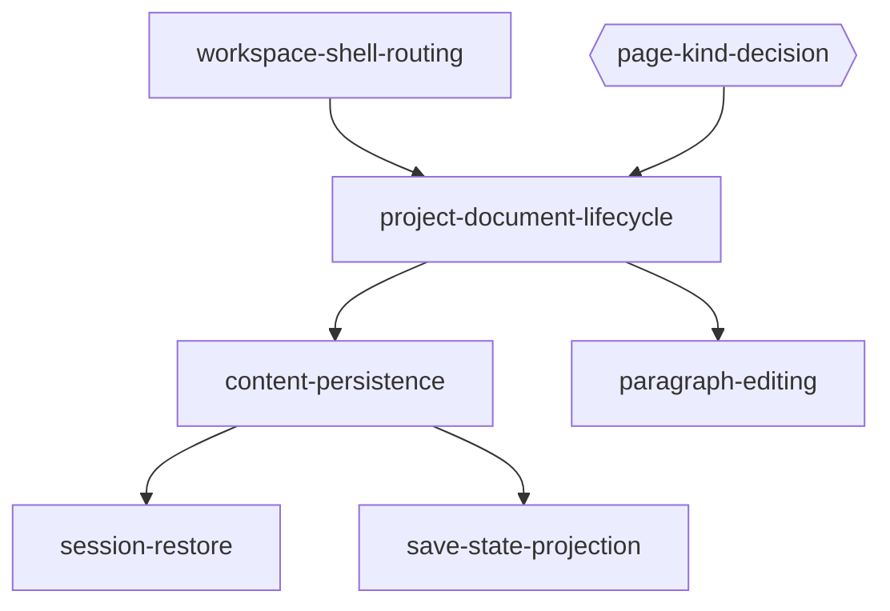
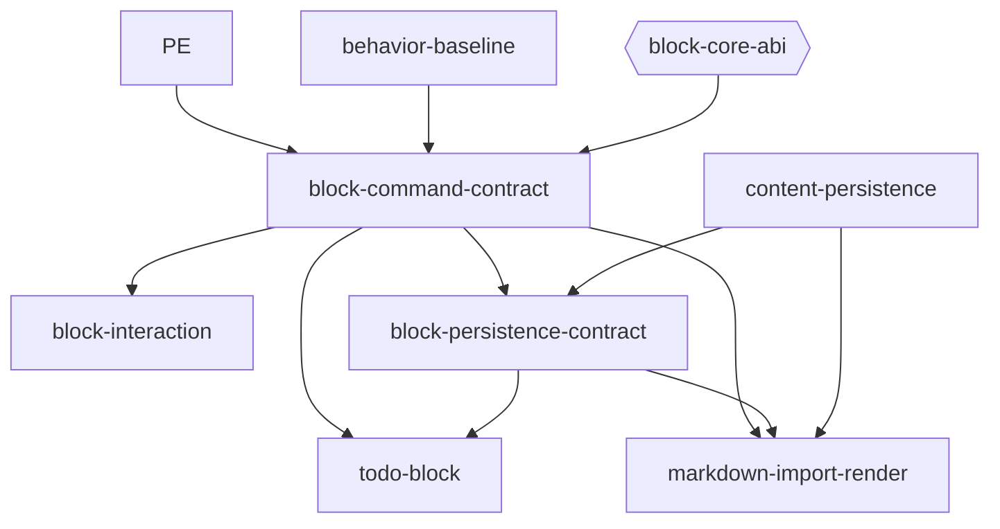
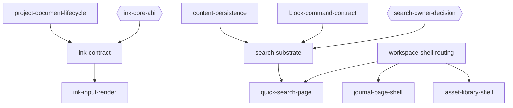
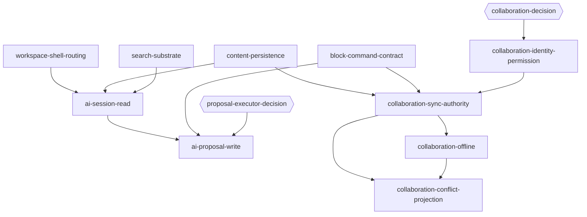

# Capability Map: Notist 筆記工作區

狀態：Approved（2026-08-23，使用者明確核准）

以上核准保留原能力責任與依賴邊界的效力。[2026-09-07 功能里程碑修正版](tasks/notist-functional-milestones-20260907.md)
為待核准草案，不繼承本 map 的 Approved，也不將既有 provider 或 consumer 紀錄視為新里程碑完整性驗收。

2026-09-07 使用者新增的第一版範圍以 [管理與資料庫範圍修訂](tasks/notist-v1-management-database-scope.md)
為準：Notist 暫時移除手寫、Krepis Ink 能力與既有資料保留；優先完成專案／筆記管理、不可巢狀資料夾、
資料庫形式的可巢狀頁面，包含自訂欄位、篩選、排序與多種視圖。這是需求更新，新增模組與 ADR 尚未核准，
亦不代表已實作。Kallopis 施工中，本輪不修改其程式或 API；缺口只記入
[元件缺口清單](tasks/notist-kallopis-component-gaps.md)，不可自行替提供者完成。

## 目的

本圖供 Notist、Kallopis、Krepis 的實作者使用。讀完後應能判斷每項能力的唯一責任、依賴、核准閘門與可獨立驗收結果。

## 已採用假設

1. 第一版以 Windows 桌面鍵盤與滑鼠為主要輸入；2026-09-07 新範圍暫停 Notist 手寫，取代原手繪板排程；行動裝置不在本輪範圍。
2. Notist 現有未提交工作樹需要保留，但其中的假筆記、假路由、固定 `Saved` 與展示內容不是產品基線。
3. Krepis ABI 1.11 已是 Flow Block、visual geometry、selection mode、editing command、undo event 與 Ink capture 的唯一 authority；Notist 不另造第二份資料真相。
4. Kallopis 只提供無產品語意的外觀與通用互動機制；選單內容、命令可用性與筆記操作規則由 Notist 決定。
5. NTS-0001～NTS-0005 仍是 Proposed；NTS-0006 已依使用者明確同意 Accepted，只關閉第一個
   `flow` runtime 與 Markdown 單向匯入邊界，不推定核准 Canva／Sheet。

## 能力模組

以下「排程」欄保留歷史分批／依賴提示，不是現行執行排程；現行提案與逐步狀態以
[功能里程碑修正版](tasks/notist-functional-milestones-20260907.md) 與
[里程碑追蹤](tasks/notist-functional-milestones-todo.md) 為入口。

### 工作區與文件基礎

| Module id | 可獨立驗收的責任 | 唯一資料／規則 owner | Depends on | 排程 |
| --- | --- | --- | --- | --- |
| `workspace-shell-routing` | 單一中央 Stage、Primary Sidebar 固定順序、空 FileExplorer 投影、功能頁 route、App Bar 與底部 status slot；無 tabs、split、Inspector | Notist 組合與 route；Kallopis shell／通用導覽元件 | — | 第一批 |
| `project-document-lifecycle` | 新專案建立一份空白文件、目前文件、在文件內容頂部直接編輯標題且同步 FileExplorer／Breadcrumb、App Bar 不重複可編輯標題、真實文件清單投影 | Krepis 文件 truth；Notist 專案選取與投影 | `workspace-shell-routing`, `page-kind-decision` | 第二批 |
| `content-persistence` | Paragraph 文件 load/save、明確成功／失敗結果、重開後內容一致；暫存格式不得宣稱正式格式 | Krepis persistence | `project-document-lifecycle` | 第二批 |
| `session-restore` | 依使用者偏好恢復「上次」或「初始」；範圍固定為專案、route／文件、Explorer 展開、文件 viewport 與 caret | Notist 偏好／導覽；Krepis 文件位置 | `content-persistence` | 第三批 |
| `save-state-projection` | 僅根據真實保存結果呈現 `saving`、`saved`、`failed` 與 retry；不冒充同步／協作 | Krepis 結果；Notist 狀態映射；Kallopis tone／slot | `content-persistence` | 第三批 |

### 第一版管理與資料庫新增範圍（待詳細計畫與 ADR）

以下為新需求模組目錄，不繼承 2026-08-23 Approved；實作必須遵守當前串行里程碑。
原 `project-document-lifecycle` 是歷史最小切片，不能代表專案／筆記生命週期已完整。
資料庫頁面是管理與 query 契約，不是 NTS-0006 所排除的 Sheet runtime；不得藉資料庫視圖繞過 page-kind gate。

| Module id | 可獨立驗收的責任 | 唯一資料／規則 owner | Depends on | 排程 |
| --- | --- | --- | --- | --- |
| `project-management-complete` | 專案建立／進入／刪除、清單與目前專案一致、保存、刪除影響及失敗恢復 | Notist 專案 UX／選取／route；專案 catalog、識別與刪除 authority 待 ADR；筆記內容仍屬 Krepis | `workspace-shell-routing`, `management-database-owner-decision` | 首版必要；完整契約與核准後 |
| `note-management-complete` | 筆記建立／編輯／釘選／取消釘選／刪除、真實清單、重開一致及失敗恢復 | Krepis 筆記內容／保存真相；Notist 命令入口與投影；釘選 metadata、刪除及恢復 authority 待 ADR | `project-management-complete`, `paragraph-editing`, `content-persistence` | 首版必要；前一步完整驗收後 |
| `flat-folder-management` | 不可巢狀資料夾、筆記歸屬、拒絕資料夾套資料夾、異動與刪除影響一致 | Notist 管理 UX；folder identity／membership／保存 owner 待 ADR，禁止 Flutter 複製筆記真相 | `note-management-complete`, `management-database-owner-decision` | 首版必要；前一步完整驗收後 |
| `database-page-hierarchy` | 可巢狀頁面以資料庫記錄表示、穩定 page identity、父子關係、防循環與刪除影響 | Krepis 頁面內容 truth；Notist 導覽與操作政策；hierarchy／membership authority 待 ADR | `flat-folder-management`, `management-database-owner-decision` | 首版必要；前一步完整驗收後 |
| `database-schema-properties` | 自訂欄位與欄位值、型別驗證、schema 變更、保存與失敗恢復 | Notist 編輯 UX；database schema／property／transaction／persistence 唯一 owner 待 ADR，不得重複筆記 schema authority | `database-page-hierarchy`, `management-database-owner-decision` | 首版必要；欄位範圍核准後 |
| `database-query` | 依真實欄位值篩選／排序，組合條件、確定性順序、變更後結果與重開一致 | Notist 查詢設定 UX；query semantics／執行／結果版本及保存 owner 待 ADR | `database-schema-properties` | 首版必要；前一步完整驗收後 |
| `database-views` | 多種視圖共用同一資料庫與 page identity、切換不複製資料、視圖設定保存 | Notist 視圖組合／互動；設定保存與 query 結果依核准 owner；Kallopis 僅消費既有通用能力 | `database-query` | 首版必要；視圖種類與前一步驗收後 |

### 編輯與手寫

| Module id | 可獨立驗收的責任 | 唯一資料／規則 owner | Depends on | 排程 |
| --- | --- | --- | --- | --- |
| `paragraph-editing` | 真實 FFI 下的文字編輯、IME、Enter split、Block 開頭 Backspace merge、undo／redo 與 caret hit-test | Krepis content／selection／transaction／history；Notist adapter | `project-document-lifecycle` | 第二批 |
| `behavior-baseline` | 針對固定日期、Notion 桌面版與 Windows 建立版本化互動矩陣；未查證項目不得成為產品規則 | Notist UX policy | — | Block 規格前 |
| `block-command-contract` | 公開 Block kind／attrs、Block 與多 Block selection、move／delete／reorder／convert 及 revision-aware command | Krepis schema／command；Notist 只定義產品可用性 | `paragraph-editing`, `behavior-baseline`, `block-core-abi` | 核心契約完成後 |
| `block-interaction` | handle、Shift 多選、Esc 層級、Slash Menu、文字工具列與右鍵選單，全部映射到同一 command registry | Notist interaction policy；Kallopis 通用 overlay／鍵盤機制；Krepis command | `block-command-contract` | Block contract 後 |
| `block-persistence-contract` | 為註冊的 Block kind／attrs 提供版本化 encode/decode、未知 kind 行為與重啟還原 | Krepis codec／persistence | `block-command-contract`, `content-persistence` | Block contract 後 |
| `todo-block` | Todo schema、勾選 command、渲染、undo／redo、重啟還原與 Journal 可讀 projection | Krepis Todo truth；Notist 呈現與 Journal mapping | `block-command-contract`, `block-persistence-contract` | 第一版必要 |
| `markdown-import-render` | 貼上 Markdown 或匯入 `.md` 後，以單一 transaction 轉成 native Block／inline marks 並由既有 display list 渲染；不支援語法保留純文字與 diagnostic | Krepis parser／content truth；Notist clipboard／file UX | `block-command-contract`, `block-persistence-contract`, `content-persistence` | Block contract 後 |
| `ink-contract` | Ink stroke／tool transaction、undo、persistence、display list 與 C ABI；不含產品工具列 | Krepis Ink truth | `project-document-lifecycle`, `ink-core-abi` | 核心能力保留；不列為 Notist 第一版新增實作 |
| `ink-input-render` | stylus 自動導向 Ink、模式鈕隱藏、快捷鍵切工具、畫面合成與明確不可用狀態 | Notist input policy；Kallopis 僅 control chrome／input primitive；Krepis render | `ink-contract` | Notist 第一版排除；既有入口停用及資料保全依新計畫驗收 |

### 專案功能與 AI

| Module id | 可獨立驗收的責任 | 唯一資料／規則 owner | Depends on | 排程 |
| --- | --- | --- | --- | --- |
| `search-substrate` | 對專案內筆記建立可重建的搜尋索引／query contract，結果保留文件與 Block identity | Krepis 筆記索引；Notist 專案範圍聚合 | `content-persistence`, `block-command-contract`, `search-owner-decision` | owner ADR 後 |
| `quick-search-page` | 固定入口、query、結果、空白／錯誤狀態與開啟單一文件 | Notist page／routing；搜尋結果來自 `search-substrate` | `workspace-shell-routing`, `search-substrate` | 搜尋契約後 |
| `journal-page-shell` | 固定入口與空白／未排程狀態；不得先定案排程 authority 或用假事件 | Notist page；未來排程聚合需另立 spec／ADR | `workspace-shell-routing` | Shell 可先做，資料功能 blocked by spec |
| `asset-library-shell` | 固定入口與空白／不可用狀態；不先發明 asset metadata／blob schema | Notist page；未來 asset authority 需另立 spec／ADR | `workspace-shell-routing` | Shell 可先做，資料功能 blocked by spec |
| `ai-session-read` | 專案級多 Chat Session persistence、read/search/summarize/chat、來源引用；無寫入能力 | Notist session／UX；讀取經各資料 owner 的 query contract | `workspace-shell-routing`, `content-persistence`, `search-substrate` | 讀取契約後 |
| `ai-proposal-write` | function/MCP 寫入只產生 Proposal，顯示影響，經使用者核准後交由同一 command authority 執行 | Notist proposal／approval；各 owner 執行自己的 command | `ai-session-read`, `block-command-contract`, `proposal-executor-decision` | NTS-0005 Accepted 後 |
| `collaboration-identity-permission` | 筆記協作者 identity、role 與 folder／document permission 判定 | Krepis note authority | `collaboration-decision` | 明確延後 |
| `collaboration-sync-authority` | 線上 mutation ordering、revision 同步、single-writer 接受／拒絕與真實連線狀態 | Krepis note authority | `content-persistence`, `block-command-contract`, `collaboration-identity-permission` | 明確延後 |
| `collaboration-offline` | 離線 queue、重連、重送／rebase 與不遺失本機已接受操作 | Krepis note authority | `collaboration-sync-authority` | 明確延後 |
| `collaboration-conflict-projection` | 僅根據 authority 真實狀態投影 pending／synced／conflict 與可採取動作 | Notist UX projection；Krepis 狀態來源 | `collaboration-sync-authority`, `collaboration-offline` | 明確延後 |

## 決策與提供者閘門

閘門不是功能模組；它們完成前，依賴它的功能不得實作 canonical runtime 行為。

| Gate id | 關閉條件 |
| --- | --- |
| `page-kind-decision` | NTS-0002 Accepted，或另立決策明定第一版只有 Flow；在此之前 Flow／Canva／Sheet 只可留在 Catalog prototype |
| `block-core-abi` | Krepis 公開並測試 Block schema、selection、transaction、revision 與 C ABI |
| `ink-core-abi` | Krepis Ink 接入 transaction、undo、persistence、display list 與 C ABI |
| `search-owner-decision` | ADR 明定 Krepis 擁有筆記索引／query，Notist 只聚合專案範圍與 route |
| `proposal-executor-decision` | NTS-0005 Accepted，並明定 single-writer executor 與 stale-base 處理 |
| `collaboration-decision` | NTS-0003／NTS-0004 Accepted，且 authority roadmap 階段一致 |
| `management-database-owner-decision` | 按當步範圍分段關閉：M1 只核准專案 catalog／lifecycle；M2 核准釘選／folder membership；M3 核准 page hierarchy／集合歸屬；M4 核准 schema／properties；M5 核准 query；M6 核准 view 設定。各步 ADR 定義當步唯一 owner、保存／刪除／遷移契約及已查證 API，不要求提前核准後續細節；不得改既有筆記內容真相或借用 Sheet runtime |

`page-kind-decision` 已由 [NTS-0006](spec/decisions/NTS-0006-first-runtime-flow-and-markdown-import.md)
關閉：第一個 production runtime 只建立 `flow`；Canva／Sheet 仍等待 NTS-0002 另行核准。

以下為既有能力紀錄；Ink 歷史 consumer 成果不改變 Notist 第一版暫停手寫的需求，亦不代表新範圍已驗收。

`block-core-abi`、`block-persistence-contract` 與 `ink-core-abi` provider gate 已推進到 Krepis ABI 1.11。
Notist consumer 已驗證 ABI 1.4 stable selection／move／convert、ABI 1.6 undo-history event、ABI 1.5/1.7
Ink outline／capture／commit、ABI 1.10 明確 text／Block selection mode，以及 ABI 1.11 跨 Block 文字
selection geometry。Block delete 仍沒有 provider command，因此維持 gated。

Notist 的 `block-interaction` 已接上 Shift stable range、context／Slash 共用 registry、Todo toggle、
same-ID convert、drag move、文字與 Block selection 分層投影，以及 `Esc`／方向鍵／`Shift+Click`／`Enter`
狀態轉換；`ink-input-render` 已完成 pointer preview／commit 與 stylus 自動導向、隱藏模式鈕的垂直切片。
多工具快捷鍵與 eraser/lasso 尚未完成。

`session-restore` 已保存啟動偏好、sidebar、route 與 stable root ID；viewport、caret 與 Explorer 展開
仍等待各自穩定 projection。`quick-search-page` 目前只查 Flow 標題／資料夾，全文與 Block identity
仍等待 `search-substrate`。Journal、資產與 AI 保持真實 empty shell，不以假資料冒充 provider query。

## 依賴方向

### 文件基礎

### Block 編輯

### 手寫與專案頁面

### AI 與延後的協作

## 建置順序

1. 從 [功能里程碑修正版](tasks/notist-functional-milestones-20260907.md) 檢視當步完整路線；目前只展開 M0，後續步驟以目錄保留。
2. 每步先規劃前端、核心或服務、資料契約、保存、錯誤恢復與測試，明列 owner、依賴 gate 與可驗收結果，再取得適用範圍核准。
3. 依「提供者實作 → 消費者接線 → 整合功能測試 → Windows 可執行成品實際啟動與截圖 → 獨立驗收」完成當步。
4. 當步功能完整性驗收全部通過且證據記入 [里程碑追蹤](tasks/notist-functional-milestones-todo.md) 後，才能展開下一里程碑；fail、blocked、未查證均維持在當步。
5. provider 測試、mock、golden、歷史通過結果不能代替當步真實整合與實機驗收。既有依賴與決策 gate 仍有效；協作仍明確延後。

## 第一批邊界：`workspace-shell-routing`

以下保留第一批歷史 scope 紀錄：當時先申請核准「建立規格與計畫」，再要求實作核准。
其歷史完成紀錄見 [workspace-shell-routing 計畫](tasks/plan.md) 與 [任務清單](tasks/todo.md)，不代表新里程碑已驗收。

第一批 runtime 驗收邊界如下：

- Sidebar 上半部依序顯示專案 Banner、快速搜尋、Journal、Notist AI、資產庫，下半部顯示 FileExplorer 容器。
- 中央永遠只有一個 Stage；沒有 tabs、split、Secondary Sidebar 或 Inspector。
- Quick Search、Journal、Notist AI、資產庫可導覽至各自明確的 empty／unavailable page，不得借用 Flow／Canva／Sheet 假裝功能完成。
- FileExplorer 在沒有真實文件 source 時為 empty state，不得保存 hard-coded Folder／Note truth。
- App Bar 與底部 status 只建立版位；沒有真實文件／保存結果時不得顯示假 Breadcrumb、字數、協作狀態或 `Saved`。
- Canva／Sheet 展示原型只能保留在 Catalog；NTS-0006 只讓 Flow 在後續已核准的
  `project-document-lifecycle` 計畫中成為 canonical runtime，不把既有 prototype 直接升格。

## 邊界規則

- Always：先在提供者倉庫定義公開契約，再由消費者接線；每批只使用各倉庫唯一 `Verify`；選擇性修改並保留現有未提交變更。
- Ask first：新增 dependency、改動 Krepis C ABI、接受 NTS ADR、調整 golden、改變既有公開 Kallopis API。
- Never：在 Kallopis 放入 Note／Block／Ink／Chat 語意；在 Notist 複製 Krepis 的內容、selection、transaction 或 undo 真相；用靜態 demo 測試宣稱真實 FFI／persistence 已驗收。
