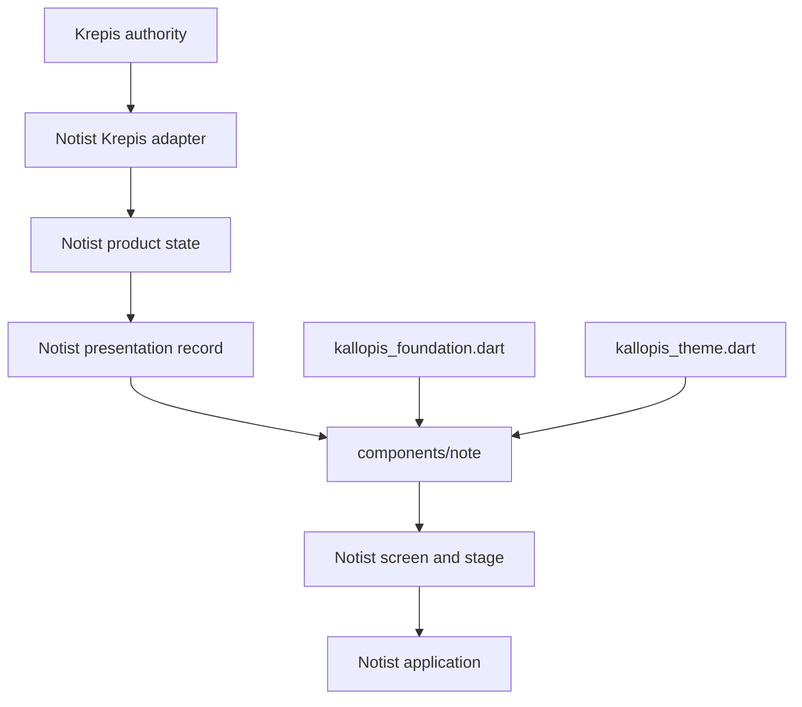

# Notist 前端架構契約

本文件提供給開發 Notist 畫面、產品元件與 Krepis 轉接層的開發者及 agent。開發前必須先用本文件判定責任歸屬，再從 Kallopis 公開入口選擇視覺能力。更完整的設計系統規則見 [Kallopis 前端架構契約](../../../Kallopis/docs/architecture/frontend-boundaries.md)。

## 目標

- Notist 負責產品畫面、筆記語意元件、呈現資料與使用者流程。
- Kallopis 負責無產品語意的視覺、theme、layout 與通用互動。
- Krepis 負責筆記資料與編輯行為的唯一真相。
- Notist 只經 Kallopis 公開入口取用能力，不依賴 `lib/src` 實作。

## 架構總覽



## 各層責任

| 層 | 目錄 | 責任 | 禁止 |
|---|---|---|---|
| 產品畫面 | `lib/src/screens/`、`lib/src/stage/`、`lib/src/shell/` | route、stage、sidebar 與使用者操作組合 | 複製 Krepis 編輯規則 |
| 語意元件 | `lib/src/components/`；筆記元件集中在 `lib/src/components/note/` | 接收 presentation record，組合 Kallopis 通用元件 | 建立通用設計系統元件 |
| 產品狀態 | 對應功能模組 | 將領域結果投影成畫面狀態 | 寫死視覺 token、直接操作平台 UI |
| Krepis 轉接 | `lib/src/krepis/` | 翻譯 Krepis 契約與生命週期 | 建立第二份 document、selection 或 undo authority |

## Kallopis 公開 API

- `package:kallopis/kallopis_foundation.dart`：穩定通用元件、布局與互動。
- `package:kallopis/kallopis_theme.dart`：穩定 theme、token、JSON 與 context API。
- `package:kallopis/kallopis_experimental.dart`：尚未承諾相容的高階 pattern，使用處須可獨立替換。
- `package:kallopis/kallopis.dart`：既有相容總入口；新程式優先使用職責入口。
- `package:kallopis/src/...`：私有實作，產品程式與測試一律禁止引用。

Experimental 能力不得包裝成 Notist 公開契約後假裝穩定。需要升級時先在 Kallopis 完成 Stable 驗收，再切換入口。
`lib/src/components/` 必須明列 `kallopis_foundation.dart`、`kallopis_theme.dart` 或隔離使用的 `kallopis_experimental.dart`；相容總入口不得成為產品元件的隱性依賴。

## Theme、environment 與 l10n

Notist 在 app 組合根注入自訂或預設 `KlpVisualStyle`；元件透過 `context.klp` 讀 semantic token。平台透過 `context.klpPlatform` 讀取。尺寸、文字縮放與語系維持使用 `MediaQuery`、`LayoutBuilder` 與 `Localizations` 的原生 context，不建立 singleton 或產品端鏡像。

Notist 若提供自訂 localization delegate，必須排在 Kallopis 預設 delegate 前面，因 Flutter 對同一資源型別採用第一個支援的 delegate。

## 禁止事項

- 不得引用或 export `package:kallopis/src/...`。
- 不得把 Note、Block、Ink、Requirement、Proposal 或保存狀態模型下沉到 Kallopis。
- 不得在 Flutter 層複製 Krepis 的 content、schema、selection、transaction、undo、layout 或 persistence。
- 不得在產品元件寫死顏色、間距、圓角、字體或動效時間。
- 不得以展示資料、固定 Saved 或假統計代替真實 empty／saving／failure 狀態。
- 不得用可變 singleton 傳遞 theme、environment、語系或編輯狀態。

## 變更流程與驗收

1. 先判定能力屬於 Kallopis、Notist 或 Krepis；跨倉契約由 authority 端先改。
2. 筆記呈現元件放入 `lib/src/components/note/`，並以 presentation record 隔離領域資料與 widget。
3. 只從 Kallopis 對應的公開入口引用；Experimental 使用點必須被清楚隔離。
4. 同批更新測試與架構文件，不得以 allowlist 掩蓋新違規。
5. 執行邊界測試、完整 analyze 與受影響測試；可交付版本再完成 Windows 實機驗收。

```powershell
D:\flutter\bin\flutter.bat test test/frontend_architecture_boundary_test.dart
D:\flutter\bin\flutter.bat analyze
```
