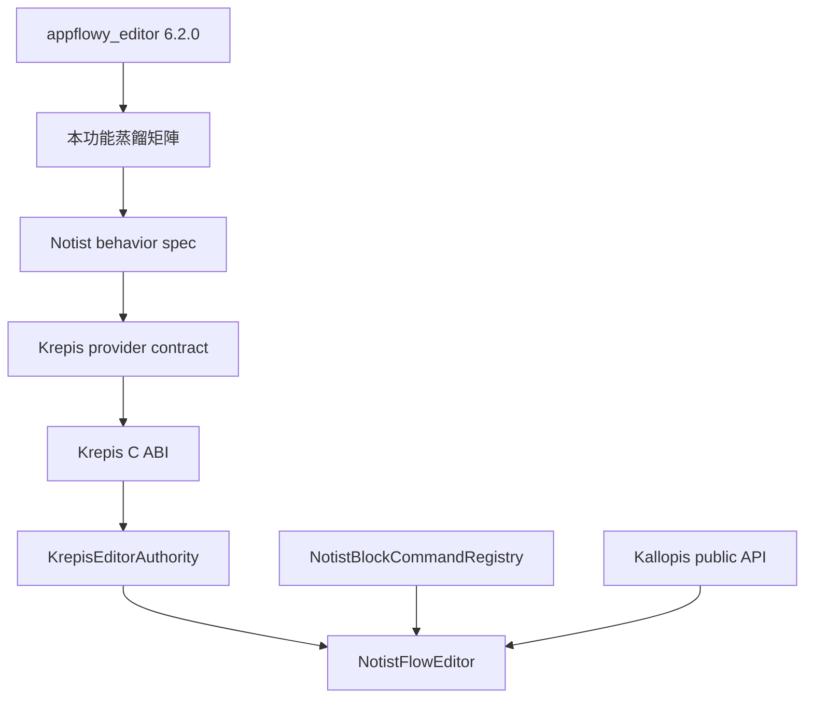

# Krepis × AppFlowy Editor 功能蒸餾矩陣（2026-09-03）

狀態：Approved baseline v0.1；P0 baseline in progress（2026-09-03 使用者採取 Q1=A、Q2=A、Q3=A；
研究專用 `6.2.0+notist-baseline.1` 已通過 Windows build／啟動、六項自訂核心行為與 24 項 package-owned tests）

讀者是 Notist、Krepis 與 Kallopis 的規劃／實作者。讀完後應能判斷一項 AppFlowy Editor 能力是否值得
蒸餾、由哪個 repository 擁有，以及下一個可驗收 gate 是什麼。本文件與第一個 P0 蒸餾 Wave 已獲
方向核准；它仍不是 Krepis command contract，個別 command 必須在 AppFlowy 實機基準完成後另立
provider spec 與驗收條件。

## 目標與動機

保留 Krepis 作為文件內容、selection、transaction、undo、layout、persistence 與 Ink 的唯一 authority，
同時以固定版本的 AppFlowy Editor 作為成熟 Flutter Block editor 的能力參照。蒸餾只記錄可觀察行為與
Notist 所需語意，不複製 AppFlowy 的 class、Widget tree、JSON schema 或內部演算法。

若不先建立矩陣，後續容易發生兩種偏移：一是按 AppFlowy release 無限追功能；二是把缺少的 editor
algorithm 臨時補進 Notist，形成 Krepis 之外的第二份 truth。

## 範圍

### In

- AppFlowy Editor 6.2.0 公開套件與 2026-09-03 可取得的官方 repository 文件／changelog。
- Windows-first 的文字、Block、selection、clipboard、快捷鍵、桌面 overlay、匯入匯出與可延伸性。
- Notist repository 現有 ABI 1.8 consumer、已核准 capability map、feature specs 與測試所能證明的狀態。
- 每項能力的唯一 owner、優先級、證據等級、差距與下一個驗收 gate。

### Out

- AppFlowy Database、Board、Calendar、AI writer、Workspace shell 與完整 AppFlowy 產品功能。
- AppFlowy Cloud、AppFlowy-Collab、帳號、permission、presence 與多人同步協議。
- 直接引入或修改 `appflowy_editor` 到 Notist／Krepis runtime；隔離研究副本只允許可追溯的編譯相容補丁。
- 在沒有固定 Windows 實機證據時，把 AppFlowy 的細部行為宣告成 Notist 產品規則。
- 本輪修改 Krepis、Notist runtime、Kallopis API、golden 或任何 persistence format。

### 凍結區

- `KrepisEditorAuthority` 仍是 Notist 唯一 editor authority；本文件不得授權 Flutter mirror state。
- Kallopis 仍只擁有 theme、token、overlay 與無產品語意的 interaction primitive。
- Canva、Sheet、Journal、Assets、AI、collaboration 與正式 P4 authority 不因本矩陣擴張範圍。
- 已存在的 Krepis reader 與 dogfood 資料不得在任何蒸餾 Wave 中提前刪除。

## 方案

### 參考版本與證據規則

| 欄位 | 固定值 |
|---|---|
| 擷取日期 | 2026-09-03 |
| AppFlowy Editor 套件基準 | `appflowy_editor 6.2.0` |
| Package SHA-256 | `c2367acdd93c7eeefaf6c58e5fed1a1c62cf02b8368102b786b5c6a0d1c583cf` |
| 研究補丁 | `6.2.0+notist-baseline.1`；[patch](evidence/appflowy-editor-6.2.0-notist-baseline.1.patch) |
| Patched tree SHA-256 | `cc7704e9025a997645b0f3ec68b74e4f27ec054973f06bba832e7e39ab494335` |
| 套件來源 | [pub.dev](https://pub.dev/packages/appflowy_editor/versions) |
| 官方功能來源 | [README](https://github.com/AppFlowy-IO/appflowy-editor/blob/main/README.md) |
| 官方變更來源 | [CHANGELOG](https://github.com/AppFlowy-IO/appflowy-editor/blob/main/CHANGELOG.md) |
| 匯入格式來源 | [Importing data](https://github.com/AppFlowy-IO/appflowy-editor/blob/main/documentation/importing.md) |
| AppFlowy source ref | 未查證；官方 repository 找不到可解析的 `6.2.0` tag，不以 `main` 冒充套件 source pin |
| 實機 baseline | [P0 Windows baseline](appflowy-editor-6.2.0-p0-windows-baseline-2026-09-03.md)；patched baseline in progress |
| Notist 平台 | Windows 桌面優先 |
| Krepis consumer baseline | ABI 1.9 implementation branch `5a0bc4d1b47d336f2d2d4abb335d3d4b41d1b56e`；MSVC Release build 540/540、CTest 104/104 通過 |

證據等級：

- `L`：Notist repository 的程式、spec 或測試可證明。
- `O`：AppFlowy 官方 README、文件或 changelog 可證明能力存在。
- `A`：固定 patched baseline 的可重跑自動化行為測試可證明核心資料結果，不等同原生 UI 實測。
- `M`：固定 AppFlowy build 的 Windows 實機操作、畫面與結果可證明。
- `U`：未查證；不得成為產品規則或完成宣告。

`O` 只能證明某類能力存在。selection 最終位置、undo grouping、混合 Block 轉換、IME 優先序等細部語意，
必須提升到 `M` 後才能寫進 Notist behavior spec。

### 蒸餾資料流

### 狀態與優先級

| 代碼 | 意義 |
|---|---|
| `Existing` | repository 證據顯示核心能力已存在 |
| `Partial` | schema、projection、UI 或部分 command 已有，但不足以關閉完整使用情境 |
| `Missing` | 目前 repository 找不到對應 provider 能力 |
| `Different` | Notist/Krepis 刻意採不同設計，不追求 AppFlowy parity |
| `Deferred` | 合法能力，但不屬第一輪蒸餾 |
| `Unverified` | 資料不足，需先研究，不能排實作 |

優先級由高到低為 `P0` correctness、`P1` 第一版 editor 完整性、`P2` 延伸能力、`P3` 明確延後。

### 功能蒸餾矩陣

| ID | 能力／可觀察行為 | AppFlowy 官方證據 | Krepis／Notist 現況 | 狀態 | Owner | 優先級 | 下一個 gate |
|---|---|---|---|---|---|---|---|
| F01 | Paragraph 文字輸入 | README：rich-text editor；changelog：Windows input、CJK/IME 修正 | Paragraph、UTF-8 input、composition、caret 已接 ABI | Partial | Krepis | P0 | Windows 繁中 IME 的 begin/update/commit/cancel 實機矩陣 |
| F02 | Enter split 與段首 Backspace merge | changelog 有 newline、Backspace 類修正；精確行為待實機 | Paragraph split／merge 已由 provider 與 consumer regression 覆蓋 | Existing | Krepis | P0 | 混合八種 Block kind 的 split/merge table-driven tests |
| F03 | Undo／redo 與操作分組 | changelog 明示多個 undo/redo 修正 | 一般編輯與 Markdown 單 transaction undo/redo 已有 | Partial | Krepis | P0 | typing、IME、convert、move、Todo、paste 各自定義 undo boundary |
| F04 | 單 Block 內 selection、caret 與 hit-test | README 明示 selection menu；細節待實機 | byte/grapheme endpoint、caret rect、hit-test 已有 | Existing | Krepis | P0 | Unicode grapheme、emoji、RTL 與 viewport scroll fixture |
| F05 | 跨 Block 文字 selection | changelog 有跨節點 selection／format 修正 | stable endpoints 已有；文字 selection geometry 尚缺 | Missing | Krepis | P0 | provider 公開 geometry/projection，Windows drag＋Shift keyboard 實測 |
| F06 | 整 Block 與連續多 Block selection | AppFlowy 產品支援 Block 操作；6.2.0 精確方式待實機 | Shift stable range 與方向保存已接線 | Partial | Krepis＋Notist | P0 | click、Shift+click、Escape、方向鍵的固定實機矩陣 |
| F07 | Stable Block delete | changelog 有 bulk delete、callout delete 修正 | provider command 尚缺，Notist 明確 gated | Missing | Krepis | P0 | revision-aware delete；stale／mixed／empty range 全部 fail closed |
| F08 | Block duplicate | AppFlowy Block menu 能力需實機確認 | handle 只呼叫一次 authority，consumer test 已有 | Existing | Krepis＋Notist | P1 | duplicate 保留 attrs/marks、產生新 ID、一次 undo、重開一致 |
| F09 | Block move／drag reorder | AppFlowy 產品 changelog 明示 Block drag | stable range／target affinity move 與 drop indicator 已接 | Partial | Krepis＋Notist | P1 | before/after、取消、stale revision、跨 viewport auto-scroll 實測 |
| F10 | Block convert 保留 identity | README 支援自訂 Block；轉換細節待實機 | same-ID convert、revision applicability 已有 | Partial | Krepis | P1 | 八種 kind 轉換矩陣，驗證 attrs 清理、marks、selection、undo |
| F11 | Paragraph／Heading 1–6 | Markdown import 官方支援 heading；style 有未支援項 | `heading`＋`level` schema、import 與 convert 已有 | Partial | Krepis | P1 | H1–H6 layout、split/merge、convert、restart fixture |
| F12 | Bullet／numbered／Todo list | README 明示 numbered/form control；changelog 明示 list undo | 三種 list kind、nestingDepth、orderedStart、taskChecked 已投影 | Partial | Krepis | P1 | nesting、renumber、indent/outdent、Todo toggle、restart fixture |
| F13 | Quote／code／divider | changelog 明示 code、divider 與 Markdown conversion；CommonMark 規定 `>` 是 quote、至少三個反引號或 `~` 是 code fence、三個以上同類 `*` 是 thematic break | 三種 native kind 與 command registry 已存在；撤回 `******` 轉 code 的自訂語法 | Partial | Krepis＋Notist | P0 | 依 CommonMark fixture 驗證 code language、newline、copy/paste、undo 與單向 import |
| F14 | Inline emphasis／strong／strike／code／link | AppFlowy 支援 formatting、link 與 Markdown | 五種 mark 可 import/project；互動式編輯 command 未證明 | Partial | Krepis | P0 | range mark command、collapsed selection policy、overlap normalization |
| F15 | Floating formatting toolbar | README 明示 toolbar menu | Notist 尚無完整文字 selection toolbar；Kallopis 可供 primitive | Missing | Notist＋Kallopis | P1 | toolbar 只投影 Krepis applicability，所有 action 走同一 registry |
| F16 | Slash menu | README 明示可客製 shortcut/menu | 共用 registry、分組、convert 與 unavailable 已接 | Partial | Notist | P1 | query/filter、keyboard navigation、IME 優先序與空結果實測 |
| F17 | Context menu 與 Block handle | README 明示 selection menu；AppFlowy 產品 UI 待實機 | handle/context 共用 registry，move/convert/Todo 已接 | Partial | Notist＋Kallopis | P1 | selection 種類、disabled reason、viewport edge positioning 實測 |
| F18 | Markdown 匯入 | 官方支援 Markdown 初始化 | heading/list/quote/code/divider/五種 mark 原子匯入已完成 | Existing | Krepis | P1 | 保留既有 8 MiB、UTF-8、stale revision、100 Blocks gates |
| F19 | Markdown 輸出與 round-trip | AppFlowy changelog 明示 nested list Markdown export | Notist 明確未承諾雙向 round-trip | Deferred | Krepis | P2 | 先裁決 canonical format 與 lossy export policy，再立 provider spec |
| F20 | AppFlowy JSON／Quill Delta 匯入 | 官方 importing 文件明示兩者 | 不屬 Notist 現有資料格式 | Different | Notist import UX | P3 | 只有真實使用情境成立後才另立 import spec |
| F21 | Plain text／Markdown clipboard | changelog 明示 plain text、HTML、node paste 修正 | `Ctrl+V` Markdown、`Ctrl+Shift+V` plain text 已有 | Partial | Krepis＋Notist | P0 | HTML、AppFlowy internal mime、跨 app、mixed Block fallback 矩陣 |
| F22 | HTML copy/paste normalization | changelog 明示 HTML encoder/decoder 與 paste 修正 | 無 HTML parser／renderer，且現規格禁止執行 raw HTML | Missing | Krepis | P1 | 先定安全 allowlist；malformed/oversized HTML 必須 fail closed |
| F23 | 圖片／附件 Block | AppFlowy Editor 支援 image，plugin 可擴充媒體 | Krepis 無 image/asset authority；Assets 仍是 empty shell | Deferred | 待 asset ADR | P2 | 先裁決 blob owner、離線 cache、失敗與刪除語意 |
| F24 | Simple table | changelog 明示 table plugin 與 HTML codec | Krepis 無 table schema/selection/layout | Deferred | 待 page-kind ADR | P2 | 先做 table cell identity、selection、transaction、migration ADR |
| F25 | Callout／toggle／column 等容器 Block | AppFlowy 產品 changelog可證明部分能力；Notion 官方明載輸入 `> ` 建立 toggle list；GitHub 文件以 `
`／`
` 表示摺疊區段 | toggle slice 已完成 kind、collapsed state、nested details import、save/reopen 與原子 `> ` live command；貼上／匯入仍按 CommonMark 形成 blockquote。Callout／column 尚未實作 | Partial | Krepis＋Notist | P0 | 另立 Callout／column provider contract；toggle slice 維持 Existing |
| F26 | Find／replace | changelog 明示 find dialog | Notist/Krepis 尚無文件內 query/replace contract | Missing | Krepis＋Notist | P2 | 全文 match projection＋單筆 replace command；large-doc fixture |
| F27 | Remote selection／協作 awareness | changelog 明示 remote selections | collaboration 明確延後；不可用 UI store 冒充 | Deferred | 未來 authority | P3 | NTS-0003 重新裁決後才建立 provider contract |
| F28 | Offline CRDT editor sync | 6.x changelog只有社群 sync plugin example | Krepis 採 typed authority／conflict 設計，不自動推導 CRDT | Different | 未來 authority | P3 | 比較 NTS-0003/NTS-0007 invariant，不屬 editor Wave |
| F29 | Theme、Block builder 與 extension point | README 明示 theme、custom Block、shortcut 可客製 | Kallopis theme＋Notist command UI；Krepis 提供語意/geometry | Existing | Kallopis＋Notist | P1 | 新 UI 不新增硬編碼 style；公開 token 缺口另送 Kallopis |
| F30 | Accessibility／keyboard-only 完整操作 | 官方 README 宣稱可客製 shortcut；完整 accessibility 未查證 | Notist 有部分 shortcuts，無完整 accessibility matrix | Unverified | Notist＋Kallopis | P1 | Windows Narrator、focus order、menu/toolbar keyboard 實測 |
| F31 | 拼字檢查 | 官方 repository 仍有 built-in spell checker feature request | Krepis/Notist 無對應能力 | Deferred | 待裁決 | P3 | 不以 AppFlowy 尚未完成能力作第一輪 parity 目標 |
| F32 | Ink、eraser、lasso 與 Block/Ink 共用 history | 官方 AppFlowy Editor 未查得等價 Ink authority | preview/capture/commit 已有；eraser/lasso/selection 尚缺 | Different | Krepis＋Notist | P1 | 保留為 Krepis 差異化；先補 eraser/lasso transaction 與 geometry |
| F33 | 本機保存與跨版本 migration | Editor 文件只證明 Document JSON 初始化，不等於正式 persistence | dogfood codec 可重開，尚非正式 P4 persistence | Partial | Krepis | P0 | versioned codec、unknown kind、crash/disk-full、舊 reader gates |
| F34 | 大文件效能與虛擬化 | 完整 patched suite：單段 selection 212ms，未通過套件 150ms gate；同次 1000-child first-selection 88ms | Krepis 有 native layout/display list，尚無本矩陣效能 budget | Partial | Krepis＋Notist | P1 | 隔離 warm-up／host load 後重測，再量 1k/10k Blocks 的 open、edit、scroll、memory baseline |
| F35 | Markdown HTML comment | CommonMark 將 `<!-- ... -->` 定義為 raw HTML block；沒有 `-#` comment 語法 | comment kind、完整 source 保存、save/reopen 與隱藏內容 projection 已通過 native／consumer／Windows gates | Existing | Krepis＋Notist | P0 | 維持 malformed raw HTML fail-closed regression |
| F36 | Inline／display LaTeX | GitHub 文件明載 `$...$` inline、`$$...$$` 或 `math` fenced block；這是 GitHub 擴充而非 CommonMark | math kind／mark、diagnostic、save/reopen 與 `flutter_math_fork 0.7.4` projection 已通過 native／consumer／Windows gates；`$$$$` 保持普通文字 | Existing | Krepis＋Notist＋Kallopis | P0 | 維持 malformed fallback 與 renderer unavailable regression |

### 第一輪建議切片

第一輪不依表格順序全部實作，只關閉會造成資料錯誤或讓核心互動無法完成的 P0 缺口：

1. `F05` 跨 Block 文字 selection geometry。
2. `F07` stable Block delete。
3. `F14` inline mark editing command。
4. `F21` clipboard interop matrix，保留既有 Markdown/plain-text 行為。
5. `F01`／`F03` Windows 繁中 IME 與 undo boundary 實機基準。
6. `F33` 正式 persistence 只先完成 ADR／codec gate，不在 editor UX 切片偷改格式。

2026-09-03 使用者要求採用真實 Markdown，撤回 `-#`、`$$$$` 與 `******` code 等自訂語法；唯一例外是
依 Notion 官方快捷行為，空白 Paragraph 的 live typing `> ` 建立 toggle list。此例外不改變貼上與匯入的
CommonMark blockquote 語意；Markdown export 仍依 NTS-0006 延後。修訂內容見
[Markdown-compatible quick input](../../spec/features/SPEC-quick-input-blocks.md)。
下一個 provider slice 必須先核准完整 profile，不會繞過 F05/F07 correctness gate，也不把 parser 複製到 Flutter。

`F32` Ink 與第一輪文字 correctness 並行規劃，但不得讓 eraser/lasso 擴張並阻塞 F05/F07/F14。

## 分步實作清單

本文件與第一輪切片已獲核准。步驟 1 已完成：官方 hash、SDK、patch、patched tree hash、Windows
Debug 成品與實際啟動畫面都有證據。步驟 2 已建立 12 個 P0 cases；其中六類核心資料行為已有 `A`
證據，原生 IME、drag／keyboard geometry、快捷鍵、外部 clipboard 與 UI undo 細節仍維持 `U`。

1. **固定 AppFlowy 實機基準**
   - 動作：取得可重現的 AppFlowy Editor 6.2.0 example 或 package archive，記錄 SHA-256、Flutter/Dart、
     Windows build 與輸入法。
   - 檔案：更新本文件「參考版本與證據規則」。
   - 證據：package hash、啟動截圖、版本輸出；無 source ref 時維持「未查證」。
2. **建立 P0 行為 cases**
   - 動作：為 F01/F03/F05/F07/F14/F21 建立前置文件、input、預期內容、selection、revision、undo 與
     restart 欄位；AppFlowy 實測結果與 Notist 採用決策分欄保存。
   - 檔案：新增對應 `docs/research/` behavior baseline，不修改 provider contract。
   - 證據：每個 case 有 AppFlowy Windows 實機截圖或錄影；無法觀察的欄位標 `U`。
3. **裁決 Notist 採用語意**
   - 動作：逐 case 選 `adopt`、`adapt` 或 `reject`，只把採用項寫進 feature spec。
   - 檔案：新增或更新 `spec/features/`；必要時先新增 ADR。
   - 證據：每個 spec requirement 回鏈到 matrix ID 與實機 case。
4. **建立 Krepis provider 計畫**
   - 動作：將採用語意轉成 stable ID、revision-aware typed command、projection、event 與 codec gate。
   - 檔案：由 Krepis repository 的獨立計畫列出；Notist 不先發明 fallback。
   - 證據：provider unit/C ABI fixture 清單可機械對應每條驗收條件。
5. **接入 Notist consumer**
   - 動作：只經 `KrepisEditorAuthority`、`NotistBlockCommandRegistry` 與 Kallopis public API 接線。
   - 檔案：`lib/src/krepis/` 與精準受影響測試；不改凍結區。
   - 證據：consumer fixture、Notist Verify、Windows Release build 與實際執行截圖。
6. **更新矩陣狀態**
   - 動作：只有 provider、consumer、restart 與 Windows 實機 gate 全部通過才將 `Partial/Missing` 改成
     `Existing`。
   - 檔案：本文件與 `CAPABILITY-MAP.md` 同批更新。
   - 證據：每個狀態變更附測試尾行、exit code、成品路徑與截圖路徑。

## 驗收條件

1. 文件固定參考日期、package version、來源與 source ref 查證狀態，不把 `main` 當成 `6.2.0`。
2. 每個矩陣項目都有 ID、AppFlowy 證據、現況、狀態、唯一 owner、優先級與下一個 gate。
3. 所有 `Existing` 都能回鏈到 repository spec／test；只靠印象的能力標為 `Unverified` 或 `Partial`。
4. 第一輪只包含 P0 correctness，Cloud、CRDT、Database、Table 與 Assets 不被偷偷納入。
5. 任一 AppFlowy 實機未觀察到的 selection、undo 或 IME 細節都不得進入 Krepis provider spec。
6. 後續每個採用行為都能以同一 fixture 驗證 provider、C ABI、Notist consumer、restart 與 Windows 實機。
7. 不支援、malformed、oversized、stale revision 與 unknown kind 至少各有一條 fail-closed 負面路徑。
8. 文件中的 repository 路徑與 Markdown 連結通過 `task-delivery` read-back，且 Git 變更只包含核准的研究
   文件、相容 patch 與實機證據，不包含 Notist runtime。

## 風險與回退

| 風險 | 偵測訊號 | 應對 |
|---|---|---|
| 無限追隨 AppFlowy | backlog 依每次 AppFlowy release 自動增長，沒有 Notist 使用情境 | package baseline 每季最多重設一次；新能力先經 adopt/adapt/reject |
| 官方資料被誤當細部行為 | spec 出現無 `M` 證據的 caret、selection、IME 或 undo 規則 | 官方文件只標能力存在；細節一律要求固定 Windows build 實測 |
| UI 與 authority 混層 | Krepis API 出現 toolbar/hover，或 Notist 保存 node/selection mirror | 依矩陣 Owner 退件；consumer 只能投影與送 typed command |

整體回退：停止尚未完成的蒸餾 Wave，保留既有 Krepis reader/ABI 與 Notist unavailable gate；不刪資料、
不把演算法移回 Flutter，也不將研究矩陣標成實作完成。

## 待裁決問題

本輪沒有未決問題。2026-09-03 已由使用者明確採取全部建議選項，裁決如下：

1. Q1=A：第一個實作 Wave 採 F05/F07/F14/F21，加上 F01/F03 實機基準，先關閉資料正確性與
   基本編輯缺口。
2. Q2=A：固定 AppFlowy Editor 6.2.0，第一個 Wave 完成前不更新 baseline。
3. Q3=A：Ink 獨立並行，不阻塞第一個文字 P0 Wave。

NTS-0009 選項 A 已於 2026-09-03 核准並完成。Krepis Release build 540/540、CTest 104/104；
Notist `test/` 154/154（含真實 ABI 1.9 DLL consumer）、產品範圍 analyze、Windows Release 與實機啟動截圖
全部通過。固定 provider commit 為 `5a0bc4d1b47d336f2d2d4abb335d3d4b41d1b56e`。
