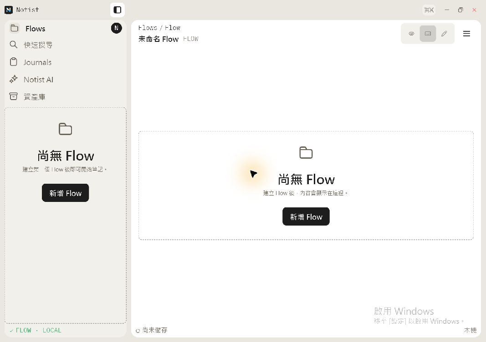

# Notist 0.1.0-beta.1 Wave A Windows 驗證

## 驗證範圍

本記錄只證明 NTS-1 的產品 metadata、Windows resource 與 fresh-profile identity。
它不取代 Wave B 的固定 provider ref、乾淨 CI、解壓縮 ZIP smoke test 或人工編輯驗收。

## 環境與成品

| 項目 | 結果 |
| --- | --- |
| 驗收日期 | 2026-08-25 |
| OS | Windows 11 Home `10.0.26200` x64 |
| Source branch | `codex/flow-runtime` |
| Wave A dirty-worktree base commit | `d6ab6611d5bc914c864faea44f7f0c5c879ac43a` |
| EXE | `build/windows/x64/runner/Release/notist.exe` |
| FileVersion / ProductVersion | `0.1.0-beta.1+1` |
| EXE SHA-256 | `4869BD5B09FF17B6A31C9A5920E8001A1E6314F4F07633E91DA2BF2479955105` |

`d6ab6611d5bc914c864faea44f7f0c5c879ac43a` 只代表驗證開始前的已提交基線；實際成品包含當時未提交的工作樹 delta，無法由該 commit 單獨重建。Wave B 必須改用乾淨 candidate SHA 重新建置，並取代這裡的成品雜湊與截圖證據。

## 驗證結果

- `tool/verify.ps1`：發行 metadata、format、analyze、Krepis ABI build 與 144 項 Flutter tests 全數通過。
- `flutter build windows --release`：完成尾行為 `√ Built build\windows\x64\runner\Release\notist.exe`。
- 使用新建的隨機 `%TEMP%` Flow 目錄啟動上述 Release 成品。
- 畫面與 accessibility tree 皆顯示 `Notist 工作區 N`、「尚無 Flow」與「尚未儲存」，
  沒有開發者個人名稱或既有 Flow fixture。

## 實機畫面

圖片 SHA-256：`CB6A5F4156EE225C13931225A51604B1058921272AF756F2ABF2FE76DC8BD9DD`

## 未驗收項目

- 本次不是從發行 ZIP 解壓縮後啟動；NTS-3 完成前不得將此證據當作發行包驗收。
- IME、Backspace、undo、redo、save/reopen、快速搜尋與 Ink smoke 仍屬 NTS-4。
