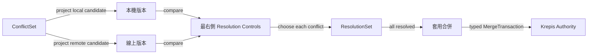

# NTS-0007：離線衝突以雙版本比較逐項裁決

## 狀態

Accepted（2026-08-24 使用者決定）

## 背景

Krepis 會自動合併能依 stable ObjectId、typed transaction 與共同祖先證明安全的修改；無法無損判定的
修改會輸出 ConflictSet。Notist 必須讓使用者理解兩個版本的差異並明確選擇，不能默默採最後寫入勝出。

## 決定

使用類似 Git conflict 的雙版本比較畫面：左側顯示本機離線版本，中央顯示 Authority 線上版本，最右側
固定為 resolution controls。每個 conflict row 都能選「採用本機」、「採用線上」或進入人工合併；若該
semantic unit 不支援人工合併，只顯示兩個合法選項，不製造 generic JSON／文字編輯器。

base 版本預設收合，需要追查差異來源時才展開。畫面依 conflict row 虛擬化；使用者選擇只建立本機
ResolutionSet，不直接改 Krepis ObjectStore。所有 conflict 解完後，「套用合併」才把完整 ResolutionSet
送成一筆 typed MergeTransaction；Authority 驗證成功後一次發布。取消或驗證失敗時保留原 ConflictSet，
不得遺失任一候選。

## 自動合併程度

這裡的「程度」不是衝突畫面顯示多少內容，而是**系統在詢問使用者以前願意自行解決多少分歧**：

- 不自動合併：所有差異都問，正確但噪音極高。
- 最大安全合併：可證明唯一且無損的結果自動處理，只問真正衝突。**本決策採用此方案。**
- 猜測式合併：依時間、最後寫入者或內容相似度替使用者選，可能靜默丟資料，禁止。

## 驗收條件

- 不同 semantic unit 的安全修改不開啟 conflict 畫面。
- 真衝突同時看得到本機與線上候選，resolution controls 固定在最右側。
- 未全部選完時不能套用；套用只提交一筆原子 MergeTransaction。
- 取消、重開與 Authority 拒絕都不遺失候選內容或既有選擇。
- 大量 conflict 只建立 viewport 內的 row，捲動不改變 ResolutionSet。
