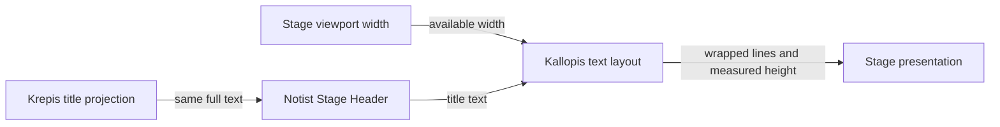

# NTS-0008：Stage 過長標題完整自動換行

## 狀態

Accepted（2026-08-24 使用者決定）

## 背景

Stage header 投影 Krepis 保存的完整文件標題。單行省略會隱藏重要差異，自動縮小字體則會破壞整體排版
層級；顯示策略必須只影響 presentation，不能建立第二份 title 或修改保存內容。

## 決定

Stage 中的標題依 viewport 提供的可用寬度完整自動換行，不使用省略號、不縮小字體、不截斷保存文字。
標題高度由實際排版結果增加，後方 Stage 內容向下排列；視窗寬度或文字尺寸改變時重新排版。標題仍只
讀取 Krepis projection，Notist 不保存 display title 副本。

## 技術邊界

- 換行使用 Kallopis semantic typography 與 spacing token；Notist 不寫死字級、行高或斷行演算法。
- `softWrap` 只改顯示；複製、重新命名、搜尋與同步仍使用完整原字串。
- 不設定產品語意上的最大行數。極長標題仍由 Flutter／Kallopis 的既有輸入與文字排版安全限制處理，
  不能為了固定 header 高度靜默截斷。
- Stage header 寬度改變後重新 layout，時間 O(t)，t 為標題文字長度；不得逐 frame 重算未變的文字。

## 驗收條件

- 長標題在窄 Stage 中換成多行，完整文字可見且沒有水平 overflow。
- 改變 Stage 寬度後行數與 header 高度正確更新，內容不與標題重疊。
- 畫面文字、Explorer 名稱與 Krepis title projection 保持同源。
- Terminal、現代化或其他 Kallopis theme 只改 token，不改本決策的完整換行語意。
