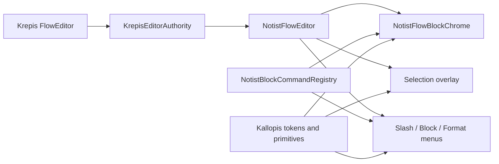

# Notion-like Block 視覺體驗蒸餾

狀態：Accepted（2026-09-03；使用者核准 V1-A、V2-A、V3-A）

## 目標與動機

Notist 保持類似 Notion 的區塊式筆記模型，蒸餾 AppFlowy Editor 已成熟的編輯器回饋、overlay 定位與
鍵盤可達性，改善目前「功能已接線，但操作感仍像底層測試畫布」的落差。AppFlowy 是研究來源，
不是產品依賴或視覺真相；遇到與 Notion 區塊互動、既有 absolute golden 或 Notist authority 邊界衝突時，
必須先由使用者裁決。

## 範圍

### In

- 單一 Flow Stage 內的頁面寬度、內容密度、留白與編輯狀態層級。
- Block hover／focus／selected chrome、左側六點把手與 gated 新增入口。
- 文字選取、整 Block 選取及連續 Block 選取的可辨識視覺投影。
- 依 caret 或 selection 錨定的 Slash Menu、Block Menu 與浮動格式工具列。
- Toggle、程式碼、引用、註解與數學公式等既有語意 Block 的一致投影。
- Windows 滑鼠、鍵盤、繁中 IME、窄視窗與 viewport 邊界的實機體驗驗證。

### Out

- 直接嵌入 AppFlowy Editor、複製其資料模型，或加入正式 runtime dependency。
- 改變 Krepis 對內容、schema、selection、transaction、undo、layout 與 persistence 的權威。
- 在 Notist 保存第二份 selection、Block 順序、格式或 optimistic document state。
- 在 Kallopis 之外硬編碼色值、字型、圓角、陰影、控制尺寸或動畫曲線。
- split Stage、tabs、Secondary Sidebar、Inspector、資料庫、表格、資產 Block 與協作游標。
- 猜測尚未由 Notion／AppFlowy 實機或 provider contract 證明的鍵盤及 IME 行為。

## 採用原則

1. **產品互動以 Notion-like Block 為準。** Notion baseline 已確認的 Block selection、handle、Slash
   Menu 與鍵盤語意優先；AppFlowy 只提供可移植的回饋、定位及可達性做法。
2. **視覺語言以 Kallopis 為準。** 蒸餾的是資訊層級與狀態，不複製 AppFlowy 的字面樣式值。
3. **資料與幾何以 Krepis 為準。** 缺少 geometry 或 command 時顯示 unavailable，不能由 Flutter 猜測。
4. **既有 shell 幾何不變。** 本切片只改善單一 Stage 內的 editor canvas；Header、Primary Sidebar 與
   Stage 結構仍受 `SPEC-absolute-golden-layout.md` 約束。2026-09-03 使用者另行裁決所有圖示預設改用
   Flaticon 字型並棄用舊 SVG，因此只核准對應的圖示像素基準更新，不授權改動 shell 幾何。
5. **相衝突即停在 gate。** 下方「待裁決問題」未核准前，不改對應行為或 golden。

## 方案

- `KrepisEditorAuthority` 只投影 provider 回傳的內容、selection、applicability 與 geometry。
- `NotistFlowEditor` 負責產品層狀態協調、overlay 生命週期及輸入模式優先序。
- `NotistFlowBlockChrome` 呈現 Block hover、selected、handle、toggle 與 drag feedback，不量測內容。
- `NotistBlockCommandRegistry` 保持所有入口的 command truth；不同 surface 可以有不同項目排序與呈現，
  但不能各自發明 enabled 狀態或 callback。
- Kallopis 提供無產品語意的 hover surface、selection surface、anchored overlay、menu、toolbar 與 tokens。

## 分步實作清單

### Wave 0：固定視覺與互動基準

- 對照既有 Notist Windows 截圖、Notion baseline 與固定 AppFlowy Editor 6.2.0 baseline，建立
  `default`、`hover`、`text editing`、`block selected`、`menu open`、`dragging` 六態矩陣。
- 將每項行為標為 `adopt`、`adapt`、`reject` 或 `unverified`；本文件的裁決只處理 `adapt` 衝突。
- 以 1600×1200 與 1024×768 固定 editor viewport，不變更 shell absolute golden。

完成紀錄：2026-09-03 已建立
[六態基準](../../docs/research/notion-block-visual-state-baseline-2026-09-03.md)；未由原生 UI 證明的欄位
維持 `U`，且未修改 production dependency 或 runtime。

### Wave 1：Block canvas 與 chrome

- 調整 Stage 內單欄閱讀寬度、段落節奏與左右 gutter，數值必須來自 Kallopis 公開 layout token。
- 依核准結果投影 hover／focus／selected 狀態，以及左側新增入口與六點把手。
- 新增入口只有在 Krepis 提供 revision-aware insert command 時啟用；否則不顯示可點擊假按鈕。
- Drag preview、drop indicator 與 viewport edge repositioning 使用 authority geometry。

進度紀錄：2026-09-03 已完成 Krepis ABI 1.10 明確 Block selection mode、Notist hover／keyboard focus／
selected chrome 與 Kallopis selection surface；未取得 revision-aware insert command，因此未顯示新增入口。
provider／consumer、Notist Verify、Windows Debug／Release build 均通過；使用者由互動桌面啟動 Release
後，default、hover 與 Block selected 實機視覺 gate 通過。Wave 1 完成，詳見
[Wave 1 驗證紀錄](../../docs/verification/notion-block-visual-wave1-2026-09-03.md)。

### Wave 2：Selection correctness 與視覺

- 先在 Krepis 關閉 F05 跨 Block 文字 selection geometry gate，再由 Notist 投影選取範圍。
- 文字 selection、單 Block selection、連續 Block selection 使用不同 semantics 與 Kallopis 狀態 primitive。
- 接上已由 Notion baseline 確認的 `Esc`、方向鍵、`Shift+Click` 與 `Enter` 狀態轉換；IME composition
  期間不攔截未查證按鍵。
- 選取失效或 revision stale 時清除 transient overlay，保留 authority 的最後有效 snapshot。

進度紀錄：2026-09-03 已由 Krepis ABI 1.11 提供逐行、跨 Block、正反向文字 selection geometry，
Notist 已接上文字／Block selection 分層投影、stale geometry 清除，以及 `Esc`、方向鍵、
`Shift+Click`、`Enter` 狀態轉換；IME composition 期間維持 fail-closed。provider 測試、真實 ABI consumer、
受影響 widget test 與 Windows Debug／Release build 已通過。使用者已裁決 Kallopis 圖示預設一律採
Flaticon 字型、棄用舊 SVG，並核准相應主畫面圖示基準更新；完整 Verify 的其餘 gate 仍須重新驗證，
因此 Wave 2 尚未標示完成；詳見
[Wave 2 驗證紀錄](../../docs/verification/notion-block-visual-wave2-2026-09-03.md)。

### Wave 3：Anchored overlays

- Slash Menu 支援 query、分組、鍵盤瀏覽、空結果及 viewport 翻轉，錨點取自 Krepis caret rect。
- Block Menu 與右鍵入口維持同一 command registry，依核准結果決定 surface 是否完全同形。
- Krepis 完成 F14 range mark command 後，加入只在非 collapsed text selection 出現的浮動格式工具列；
  每個 action 只投影 revision-matched applicability。
- Overlay 開啟、`Esc`、點擊外部、focus loss 與 IME composition 的優先序建立 widget matrix。

### Wave 4：語意 Block 呈現一致化

- Toggle 的 disclosure、縮排、收合內容與 hover 區域使用同一 Block chrome 節奏。
- Code、quote、comment、math 的 empty、editing、invalid 與 readonly 狀態使用 Kallopis semantic primitive。
- Markdown 設定維持 NTS-0009：CommonMark/GitHub 支援的語法照標準解析，只有 live `> ` 依使用者核准
  轉為 Toggle；paste/import 的 `>` 仍是 blockquote。

### Wave 5：驗證與交付

- 為狀態矩陣建立 widget/golden tests，並保留 Kallopis style contract 的機械掃描。
- 執行 Notist 受影響測試、完整 Verify、Windows Release build。
- 在 Windows 實際啟動 Release 成品，以真實文件驗證滑鼠、鍵盤、繁中 IME、選單邊界與重開一致性，
  產出 1600×1200 截圖；widget/golden 圖不能替代實機證據。
- 只有 provider、consumer、restart 與 Windows 實機 gate 全部通過，才更新 capability matrix 狀態。

## 驗收條件

1. Production dependency graph 不含 AppFlowy package；Notist 只保留有來源與版本的研究證據。
2. Header、Primary Sidebar、單一 Stage 與既有 absolute golden 區域順序不變，1024×768 無水平 overflow。
3. 內容點擊只進入文字編輯；Block selection 只能由核准的 handle、快捷鍵或 range gesture 觸發。
4. `default`、`hover`、`focus`、`text selection`、`block selection`、`dragging` 六態可由 widget test
   機械區分，且不存在永遠顯示 active chrome 的假狀態。
5. Slash Menu 錨定 caret，格式工具列錨定 selection，Block Menu 錨定 handle／pointer；三者在上下左右
   viewport 邊界內皆不溢出，`Esc` 可依狀態優先序關閉。
6. Context、Slash 與 format surface 的同一 command id 來自同一 registry/applicability；disabled command
   不觸發 callback，stale revision 不產生 optimistic UI。
7. 未取得 F05 geometry 前找不到跨 Block 文字 selection overlay；未取得 F14 command 前找不到可操作的
   浮動格式 action；未取得 insert command 前找不到可點擊新增入口。
8. Toggle、code、quote、comment、math 的語意內容由 Krepis snapshot 決定，Flutter 不保存第二份 Block truth。
9. `kallopis_style_contract_test.dart` 證明 Notist 未新增字面顏色、字型、圓角、尺寸或 Material 互動元件。
10. Notist Verify 與 Windows Release build exit code 0，並附實際 Release 成品路徑、啟動截圖及繁中 IME
    實測紀錄；任何未通過項不得標示完成。

## 風險與回退

| 風險 | 偵測訊號 | 應對／回退 |
|---|---|---|
| AppFlowy 視覺反客為主 | UI review 只能用 AppFlowy 截圖解釋，無法對應 Notion Block 狀態 | 停止該切片，退回已核准 Notion baseline 與 Kallopis primitive |
| UI 複製 authority | Flutter 新增 selection range、Block 順序或格式真相 | 移除 consumer mirror，先回 Krepis 補 geometry/command gate |
| Kallopis 與 Notist 混層 | Notist 出現字面 style 值或 Kallopis 出現 Note/Block model | 退回最後通過 style contract 的版本，分別以 semantic intent／通用 primitive 重做 |
| Overlay 與 IME 爭用 | 組字期間 `/`、`Esc` 或 `Enter` 提前提交／關閉 | 該快捷行為維持 unavailable，保存輸入內容並補固定 Windows IME case |
| 大文件掉幀 | 1k Block scroll、hover 或 selection overlay 明顯超出後續核准 budget | 關閉昂貴 overlay，保留既有 painter；另立 virtualization provider gate |
| Golden 掩蓋實機問題 | widget 圖通過但 Windows caret、menu 或縮放錯位 | 不交付；以 Release 實機為最終 gate，golden 只作回歸輔證 |

整體回退以 Wave 為單位：保留已通過的前一 Wave、關閉未完成入口，不回寫資料、不降級 Krepis ABI，
也不以 hard-coded 畫面替代缺失能力。

## 待裁決問題

### V1：左側 Block chrome 顯示時機

- **A（建議）**：採 Notion-like 行為；新增入口與六點把手只在 Block hover、keyboard focus、selected 或
  dragging 時顯示，觸控／鍵盤另有可達入口。
- B：維持目前六點把手常駐，只蒸餾 hover 回饋。

衝突：目前 `NtsBlockChrome` 常駐把手；改為 A 會改動既有畫面與 golden，但可顯著降低畫布工具感。

### V2：整 Block selection 視覺

- **A（建議）**：採 Notion-like 輕量面狀 highlight，連續多選形成連續範圍；focus ring 僅供鍵盤焦點。
- B：維持目前每個 Block 各自描邊。

衝突：現況以獨立 outline 呈現 selected；A 更接近內容選取，但需要 Kallopis 新增通用 selection surface，
且精確透明度／顏色仍由 Kallopis 決定。

### V3：六點選單與文字右鍵選單

- **A（建議）**：共用 command registry，但按 surface 分流。六點選單處理 Block 操作；文字右鍵優先處理
  selection／clipboard／格式，只有整 Block selection 才顯示 Block 操作。
- B：維持現規格，六點與所有右鍵入口開啟相同 Block 操作選單。

衝突：A 更符合 Notion 的區塊／文字兩層選取模型；但 Notion 右鍵項目精確排序目前仍未實機查證，
因此第一輪只核准分流原則，不猜測項目排序。

## 核准閘門

2026-09-03 使用者以 `核准視覺蒸餾 V1-A、V2-A、V3-A` 核准本規格。後續研究若遇到新的
Notion／AppFlowy 行為衝突，必須追加為新裁決項並停在該項前詢問，不沿用猜測。
