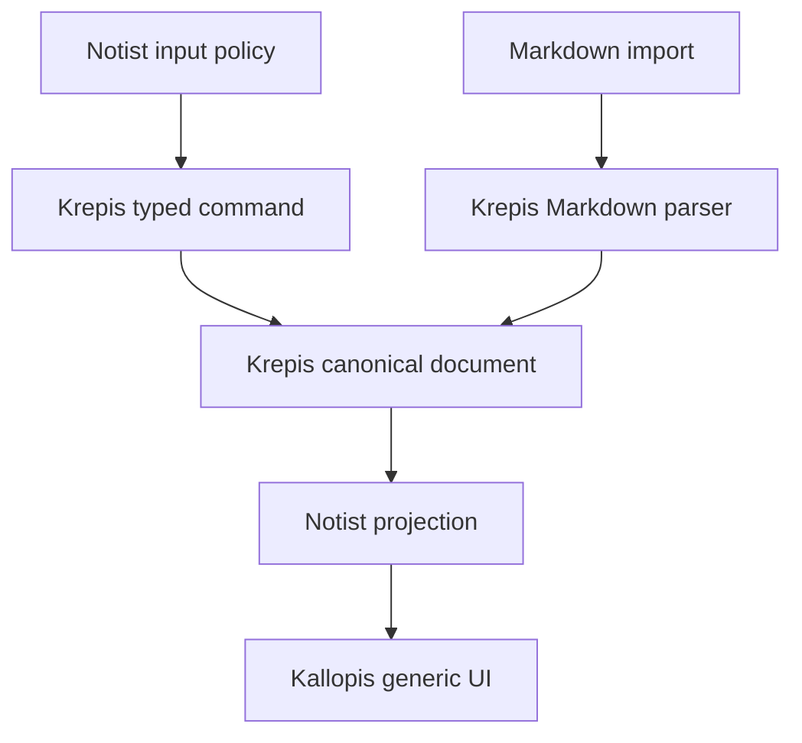

# Spec: Markdown-compatible quick input

狀態：Implemented／Verified（2026-09-03；Krepis CTest、Notist native consumer、Windows Release 與實機啟動 gate 通過）

## 目標與動機

讓 Notist 的即時輸入與單向 Markdown 匯入使用可查證、可攜的語法，不把產品快捷鍵偽裝成 Markdown。
基準採 CommonMark 0.31.2；CommonMark 沒有的摺疊與數學功能，只採 GitHub 官方明載的擴充並標示方言。
Notist 擁有輸入體驗政策；Krepis 仍擁有文字、Block、selection、transaction、undo 與 persistence 真相。

## 範圍

### In

- CommonMark 的引用、分隔線、程式碼圍欄與 HTML comment 單向匯入。
- GitHub Markdown 的 `
` 摺疊區段與 LaTeX 數學式擴充。
- 在空白 Paragraph 開頭輸入 `> ` 時，依 Notion 官方快捷行為建立 toggle list。
- 即時輸入、貼上、單向匯入、undo／redo 與 save／reopen 的一致行為。
- 不支援或解析失敗時保留原始 Markdown，不顯示假成功。

### Out

- 不支援原先草案自行定義的 `-#`、`$$$$` 或六個 `*` 程式碼語法。
- 不把 `> ` toggle 宣稱為 CommonMark；它是明確記錄的 Notist／Notion-style live-input policy。
- 不在 Flutter 建立第二套 Markdown parser、文件 authority 或 undo stack。
- 不新增 Markdown export、source-mode 或雙向無損 round-trip；維持 [NTS-0006](../decisions/NTS-0006-first-runtime-flow-and-markdown-import.md) 的既有邊界。
- 只依本規格修改 Krepis schema、codec 與 C ABI；任何額外 Markdown 方言仍須另案核准。

## 方案

### 語法真相表

| 意圖 | 採用語法 | 標準／方言 | 明確排除 |
|---|---|---|---|
| 註解 | `<!-- comment -->` | CommonMark raw HTML block；rendered HTML 不顯示其內容 | `-#` 不是 Markdown 註解 |
| 引用檔案語法 | `> quote` | CommonMark blockquote；貼上與匯入維持此語意 | live typing `> ` 由下列唯一例外攔截 |
| 摺疊輸入快捷 | 空白 Paragraph 開頭輸入 `> ` | Notion 官方明載的 toggle-list shortcut；不是 CommonMark 語法 | 不套用於貼上、檔案匯入或 IME composition update |
| 摺疊匯入格式 | `

標題
內容
` | GitHub 文件明載的 HTML-based Markdown 擴充 | CommonMark 沒有專用的摺疊列表語法；本輪不承諾匯出 |
| 行內 LaTeX | `$x^2$` | GitHub Markdown 數學擴充，不屬 CommonMark | `$$...$$` 不作行內公式 |
| 區塊 LaTeX | `$$x^2$$` 或 info string 為 `math` 的 fenced code block | GitHub Markdown 數學擴充，不屬 CommonMark | 不採 `$$$$...$$$$` |
| 程式碼區塊 | 至少三個連續反引號或 `~` 的 fenced code block | CommonMark fenced code block | 六個 `*` 不是程式碼區塊 |
| 分隔線 | 三個以上相同的 `*`、`-` 或 `_`，符合 CommonMark 空白規則 | CommonMark thematic break | `******` 必須仍是分隔線 |

`> ` 是唯一獲准偏離 Markdown parser 的 live-input shortcut：尾端空格是 commit key，不屬文件內容。它只在
空白 Paragraph、selection 收合且 IME composition 已結束時轉換；貼上與匯入的 `>` 仍按 CommonMark 成為引用。

`<!-- ... -->` 在 Markdown 中是 raw HTML comment，不是可見的審閱留言。Krepis 保存其原始 UTF-8，rendered
projection 不顯示內容；若產品日後需要多人審閱留言，應另立
comment-thread 規格，不得宣稱它是 Markdown 原生功能。

### 資料與操作流

- Notist：提供語法提示、輸入入口、Slash Menu、啟用政策與 unavailable reason。
- Krepis：依選定方言解析並轉成 canonical schema，原子地更新文件、selection、revision 與 history。
- Kallopis：提供 quote、details、code、math 與 comment placeholder 所需的通用視覺 primitive，不保存內容。
- 除已裁決的 `> ` 外，匯入、貼上與即時輸入共用同一語法規則；不得再增加未記錄的秘密方言。

既有 `cmark-gfm` `0.29.0.gfm.13` core extensions 沒有 math 或 details semantic extension；實作不得呼叫
不存在的 API。Krepis provider contract 要先以最小 prototype 證明 delimiter、source range、巢狀 HTML 與
錯誤恢復策略，再選擇已查證的 custom extension 或獨立 scanner。

## 分步實作清單

1. **凍結 Markdown profile**
   - 文件：本規格與 [NTS-0009](../decisions/NTS-0009-markdown-profile-and-toggle-shortcut.md)。
   - 動作：固定 CommonMark 0.31.2 核心、GitHub 摺疊／數學擴充及唯一的 `> ` live-input 例外。
   - 證據：官方來源、fixture 清單與人類核准紀錄。
2. **擴充 Krepis provider contract**
   - 文件／程式：Krepis schema、codec、typed command、C ABI 與 provider tests。
   - 動作：實作 comment raw node、details container、inline/display math 與 revision-aware `> ` toggle command；
     既有 Markdown quote、code、divider parser 不改語意。
   - 證據：parser prototype、mapping golden、unknown-kind 與舊 reader fail-closed tests。
3. **接入 Notist 操作體驗**
   - 程式：`lib/src/krepis/` 的 authority consumer、command registry 與精準受影響 widget。
   - 動作：輸入完整語法後投影正確 Block；所有修改仍經 Krepis transaction。
   - 證據：consumer fixture、widget tests 與 undo／redo tests。
4. **Windows 實機驗收**
   - 動作：逐項輸入、單向匯入、保存與重開；不執行未核准的 Markdown export。
   - 證據：Windows Release executable、實際啟動截圖與測試尾行。

## 驗收條件

1. 在空白 Paragraph 鍵入 `> ` 後得到 toggle list，trigger 字元被移除，undo 一次恢復 `> ` 與原 selection。
2. 貼上或匯入 `> quote` 後仍得到 blockquote；不得被 live-input policy 轉成 toggle。
3. 匯入 `******` 後得到 thematic break，不得成為 code block。
4. 匯入以至少三個反引號或 `~` 包住的內容後得到 code block，info string 與 literal content 不遺失。
5. `<!-- comment -->` 可無損匯入為 comment source；rendered projection 不顯示內容，Krepis 保存原始 UTF-8。
6. 匯入 `
` 後，`summary`、children 與 open state 經 save／reopen 不遺失。
7. `$...$` 投影為行內公式；`$$...$$` 與 `math` fenced block 投影為區塊公式；`$$$$` 不被識別為獨立語法。
8. 畸形 HTML／LaTeX、IME composition、stale revision 或 renderer unavailable 時保留原始 source 並顯示明確狀態。
9. 每次成功轉換及 undo／redo 由 Krepis 單一 transaction authority 完成。
10. Krepis provider tests、C ABI fixtures、Notist Verify、Windows Release build 與實際運行截圖全部通過。

## 風險與回退

1. **方言混淆**：偵測訊號是同一輸入在 CommonMark 與 GitHub renderer 結果不同；Notist 匯入 UI 明示採用的
   profile，Krepis diagnostic 回報實際套用的 extension，不暗中切換 parser。
2. **raw HTML 安全性**：偵測訊號是匯入可執行或危險 tag；採 allowlist／sanitization，未知內容保留 source 但不執行。
3. **LaTeX renderer 失敗**：偵測訊號是 parse error、未知 command 或資源耗盡；顯示原始 source 與 failure，禁止任意命令。

整體回退：保留既有 Krepis reader、ABI 與 Notist unavailable gate，不寫入新 kind，也不把解析移到 Flutter。

## 已裁決問題

1. 採用「CommonMark 0.31.2 核心＋GitHub 官方摺疊／數學擴充＋唯一的 `> ` Notion-style live-input
   例外」作為 Notist Markdown profile。
2. Markdown export、source-mode 與雙向 round-trip 不在本次範圍。

## 查證來源

- [CommonMark 0.31.2 specification](https://spec.commonmark.org/0.31.2/)
- [GitHub Docs: Organizing information with collapsed sections](https://docs.github.com/en/get-started/writing-on-github/working-with-advanced-formatting/organizing-information-with-collapsed-sections)
- [GitHub Docs: Writing mathematical expressions](https://docs.github.com/en/get-started/writing-on-github/working-with-advanced-formatting/writing-mathematical-expressions)
- [Notion Help: Keyboard shortcuts](https://www.notion.com/help/keyboard-shortcuts)
- [cmark-gfm core extension registry](https://github.com/github/cmark-gfm/blob/master/extensions/core-extensions.c)
