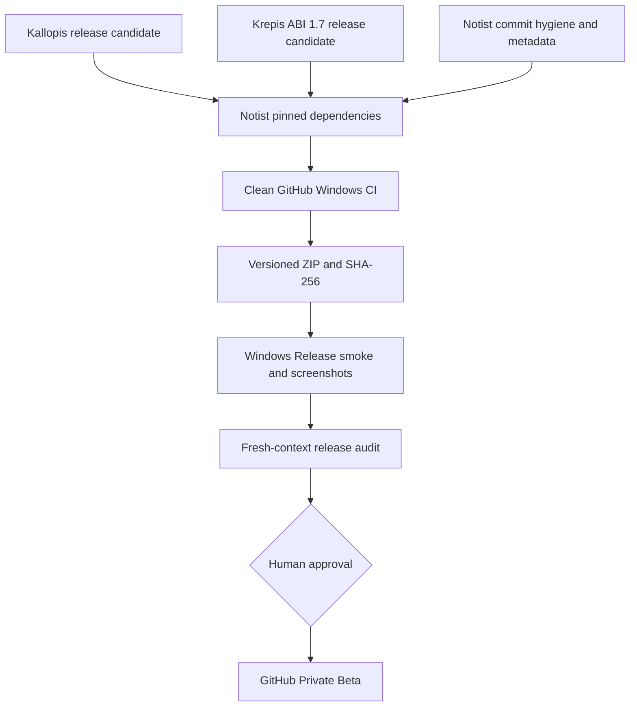

# Notist GitHub Private Beta 發布計畫

## 目標與動機

把目前可在 Windows 實機啟動的 Notist 工作副本，整理成可由 GitHub commit 重建、可追溯、可回退的
Private Beta。Kallopis、Krepis、Notist 分別交付自己的版本真相；Notist 擔任最終整合與發行責任人。

目前不能直接發布的主因不是功能測試，而是 138 項未整理變更、版本宣告與成品名稱不一致、發行包過期、
本機相鄰 repo 依賴，以及缺少 CI、發行說明與乾淨環境驗收。

## 範圍

### In

- Kallopis 交付可由 Git ref 固定的 Flutter 視覺套件候選版。
- Krepis 交付 ABI 1.7 的可重建 CMake／DLL 候選版。
- Notist 整理提交、固定依賴、建立 Windows CI、產生 Beta ZIP、checksum 與 Release Notes。
- 使用乾淨測試資料目錄執行 Windows Release 實機 smoke test 並留下截圖。
- 由 fresh-context Reviewer 對 commit、成品與證據做獨立稽核。

### Out

- 不在本輪補齊 stable Block delete、跨 Block 文字 selection geometry、全文搜尋或 AI provider。
- 不發布 Android、iOS、macOS 或 Linux Beta。
- 不在未核准前建立或推送 tag、GitHub Release、簽章憑證或公開倉庫。
- 不把三個 repo 合併成 monorepo，也不複製 Krepis／Kallopis 原始碼進 Notist。

### 凍結區

- 不改 Krepis 文件與編輯語意來迎合 Notist UI。
- 不把 Notist 產品語意放進 Kallopis。
- 不清除、reset、stash 或吞入來源未確認的人類／其他 agent 變更。
- 不以 `git add .`、force push、重新產生全部 golden 或調高測試 baseline 取得綠燈。

## 方案



### 責任邊界

| Repo／角色 | 擁有 | 不擁有 |
| --- | --- | --- |
| Kallopis | `pubspec` 版本、公開 Flutter API、design assets、套件 license／changelog | Notist 導覽、筆記語意、GitHub Release ZIP |
| Krepis | CMake 版本、ABI 1.7、C ABI symbols、核心 DLL、第三方 native license | Notist UX、Flutter binding 政策、產品版本 |
| Notist | 產品版本、依賴 pin、CI、ZIP、Release Notes、實機驗收、GitHub Release | 重定義 Kallopis API 或 Krepis authority |
| Reviewer | 獨立重建、比對 checksum、找發布 blocker | 修改實作、替作者解釋失敗 |

## 分步實作清單

### Wave A：三庫可平行

#### KLP-1 — Kallopis release candidate

- 盤點 Kallopis 工作樹，分離本次可發布內容與無關變更。
- 確認 `pubspec.yaml` 的 `0.8.0` 是否為本輪核准版本；更新 CHANGELOG 與公開 API 清單。
- 驗證 Git ref checkout 後，Notist 所需元件全部從 `lib/kallopis.dart` 公開。
- 執行 `flutter analyze`、`flutter test`、`example/flutter test` 與 golden。
- 產出候選 commit SHA；未經人類核准不得建立或推送 tag。

完成證據：乾淨候選 commit、三組驗證 exit code 0、CHANGELOG、Notist 所需 symbol 清單。

#### KRP-1 — Krepis ABI 1.7 release contract

- 解決 `project(krepis VERSION 0.0.1)` 與 ABI `1.7` 的發行識別關係，文件明確區分產品版本與 ABI 版本。
- 讓外部 consumer 可從固定 commit／tag 取得 Krepis，且支援 CMake `add_subdirectory` 的隔離 build。
- 鎖住 `krepis_c.dll`、公開 headers、ABI identity 與所需 native dependencies。
- 執行 Debug 與 Release build；兩者分別跑完整 CTest。
- 產出第三方授權清單及候選 commit SHA；未核准不得推送 tag。

完成證據：Debug／Release CTest 尾行、ABI 1.7 consumer fixture、候選 SHA、授權清單。

#### NTS-1 — Notist Git 與產品 metadata 整理

- 對 138 項變更逐組確認來源與意圖，依功能、測試、平台、文件拆成原子 commits。
- 將 `pubspec.yaml`、Windows resource、ZIP 名稱與 Release tag 統一成同一 Beta 版本。
- 移除 `Chia-Yu` 等個人化硬編碼，fresh profile 不得顯示開發者個人資料或既有測試文件。
- 更新 README 的現況、Windows 前置需求與明確已知限制。
- 建立 CHANGELOG、Release Notes、SECURITY；Private Beta 可暫不採公開原始碼授權，但第三方 notices 必須保留。

完成證據：`git diff --check` exit 0、無未確認變更、版本檢查腳本通過、fresh profile screenshot 無個人資料。

### Wave B：等待 Kallopis／Krepis 候選 SHA

#### NTS-2 — 可重現依賴與 Windows CI

- 移除 Kallopis `dependency_overrides.path`，改用核准的固定 Git ref。
- 移除 Notist Windows CMake 對 `../../Krepis` 的唯一依賴；改用核准且固定的 Krepis source ref／可配置 source dir。
- CI 必須從乾淨 checkout 取得固定依賴，執行 format check、analyze、Krepis build、Notist tests 與 Windows Release build。
- CI 不使用開發者機器既存的 `../Kallopis`、`../Krepis`、build cache 或未提交檔案。

完成證據：GitHub Windows runner 從空 checkout build 成功，產出的 Notist consumer 回報 ABI 1.7。

#### NTS-3 — 發行包與 checksum

- 用單一腳本從剛完成的 Release bundle 建立 `Notist-<version>-windows-x64.zip`。
- ZIP 頂層包含 README、Release Notes、第三方 notices、EXE、DLL、`native_assets.json` 與完整 `data/`。
- 腳本拒絕版本不一致、dirty worktree、缺 DLL、缺 data 或 stale build timestamp。
- 產生 SHA-256 sidecar，並在乾淨暫存目錄解壓後啟動同一份 EXE。

完成證據：ZIP、`.sha256`、內容 manifest；解壓成品雜湊與 build bundle 相符。

#### NTS-4 — Windows Beta 實機驗收

- 設定新的空白 `NOTIST_FLOW_PROJECT_PATH`，避免沿用開發者 `%LOCALAPPDATA%\Notist\Flows`。
- 從解壓 ZIP 啟動 Release，而不是從 `build/` 或 IDE 啟動。
- 驗收 fresh start、新增 Flow、輸入繁中 IME、Enter、Backspace、Ctrl+Z、Ctrl+Y、保存、關閉重開、快速搜尋與 Ink pointer smoke。
- 截取 fresh workspace、Flow 編輯、快速搜尋三張實機畫面；記錄 OS、版本、commit、ZIP SHA-256。
- 未簽章版本必須在 Release Notes 明示 Windows 警告與 checksum 驗證方法。

完成證據：逐項 pass/fail 記錄、三張 Release 實機截圖、重開後內容一致。

### Wave C：獨立驗收與發布

#### REV-1 — Fresh-context release audit

- 只從 GitHub 候選 commit 與候選 ZIP 開始，不採信實作者的 build 目錄或口頭結論。
- 找出版本、授權、個資、依賴、ABI、包內容、文件、可回退性與 smoke test 的 blocker。
- 重新執行 CI 等價命令，核對 ZIP SHA-256 與 screenshot 對應版本。

完成證據：獨立的 Approve／Request changes 報告；所有 Critical／Required 項歸零才可進下一步。

#### REL-1 — 人類核准後建立 GitHub Private Beta

- 使用核准 commit 建立 annotated tag。
- 建立 Draft／Prerelease GitHub Release，附 ZIP、SHA-256、Release Notes、已知限制與回退版本。
- 上傳後重新下載資產、核對 checksum、在第一小時執行一次 critical flow。

完成證據：GitHub Prerelease URL、下載後 checksum、post-release smoke 結果。

## 驗收條件

1. 三個 repo 的候選 commit 都能由 fresh checkout 重建，不依賴未提交 sibling workspace。
2. Notist tag、`pubspec`、Windows ProductVersion、ZIP 名稱與 Release Notes 顯示同一版本。
3. GitHub Windows CI 的 format、analyze、CTest、Flutter test、Release build 全部 exit code 0。
4. ZIP 解壓後包含 `notist.exe`、`flutter_windows.dll`、`krepis_c.dll`、`native_assets.json`、`data/`、README、Release Notes 與 notices。
5. ZIP SHA-256 sidecar 與重新下載資產的雜湊完全相同。
6. Fresh profile 不出現 `Chia-Yu`、測試 fixture 或開發者既有 Flow。
7. Windows Release 人工驗收的 IME、Backspace、undo、redo、save/reopen 全部標為通過；任一失敗即 No-Go。
8. 缺少 provider 的功能只顯示 unavailable／known limitation，不產生假資料或可點擊的假成功。
9. Fresh-context Reviewer 沒有未解的 Critical 或 Required finding。
10. 未經人類明確核准，不存在遠端 tag 或 GitHub Release；這是負面路徑驗收。

## 風險與回退

| 風險 | 偵測訊號 | 應對 |
| --- | --- | --- |
| 整理 138 項變更時吞入他人工作 | commit 同時跨多個無關功能、來源不明 binary／config | 指定路徑 add、每批 diff review；來源不明即停下問人類 |
| Pin 之後 API／ABI 不相容 | CI fresh checkout compile 或 ABI fixture 失敗 | Kallopis／Krepis 各自在候選 branch 修正；Notist 不加 fallback 偽裝相容 |
| ZIP 與驗證成品不是同一版 | app.so／DLL hash、版本或 timestamp 不一致 | 打包腳本直接從 CI artifact 取材並產 manifest，拒絕手工複製 |

整體回退：GitHub Release 保持 prerelease；發現資料完整性、ABI 或啟動問題時撤下 asset／標記 withdrawn，
回退到上一個已驗證 tag，不重寫 tag。

## 已裁決問題

2026-08-25 人類以 `AABA` 裁決：

- **Q1 發布可見性：A** — Private repository Prerelease。
- **Q2 Notist 版本：A** — `0.1.0-beta.1+1`；人工 IME／保存驗收必須全過。
- **Q3 Krepis 版本：B** — 建立新的 core prerelease tag；具體號碼由 Krepis owner 提案後再由人類核准。
- **Q4 Windows 簽章：A** — Private Beta 暫不簽章，Release Notes 揭露警告並提供 SHA-256。

以上裁決只凍結方案選項；建立／推送 tag 與 GitHub Release 仍需發布當下的人類明確核准。

## 分工 Prompt

### Prompt A — Kallopis Agent

```text
你是 Kallopis release owner。目標是交付一個可被 Notist 以固定 Git ref 消費的 Kallopis release candidate，
解除 Notist 的本機 dependency_overrides；不得修改 Notist 或 Krepis。

工作目錄：C:\Projects\Kallopis
先完整閱讀 AGENTS.md、.agents/skills/agent-entry/SKILL.md、work-protocol、task-delivery、
task-development 與 personal-code-style。保留現有 dirty worktree，先辨識每項變更來源，不得 reset、stash、
git add .、推 tag 或推 remote。

任務：
1. 稽核目前 0.8.0 的公開 API、資產、localization 與 CHANGELOG，確認 Notist 所用 symbols 全部由
   lib/kallopis.dart 公開。
2. 將可發布內容整理成原子 commit 建議；不要吞入來源不明變更。
3. 執行 dart format check、flutter analyze、flutter test、example/flutter analyze、example/flutter test。
4. 產出候選 commit SHA、建議 tag、Notist 應使用的 git ref，以及任何 breaking change。

驗收：所有 gate exit code 0；fresh checkout 用候選 ref 可 flutter pub get；LICENSE、CHANGELOG 與資產完整；
不得存在尚未提交卻是 Notist build 必需的檔案。

回報只包含：【結論】【候選 SHA／建議 tag】【驗證尾行】【Notist 所需 ref】【未解 blocker】。
不要替自己的候選版核准；要求 fresh-context reviewer 驗證。
```

### Prompt B — Krepis Agent

```text
你是 Krepis release owner。目標是交付 Notist 可從固定 ref 重建的 ABI 1.7 Krepis candidate；不得修改
Notist UX 或 Kallopis。

工作目錄：C:\Projects\Krepis
先完整閱讀 AGENTS.md、.agents/skills/agent-entry/SKILL.md、work-protocol、task-delivery、
task-development 與 personal-code-style。保留 dirty worktree，不得 reset、stash、git add .、推 tag 或推 remote。

任務：
1. 稽核 CMake project version 0.0.1 與 C ABI 1.7 的版本關係，提出不混淆兩者的 release naming。
2. 確認固定 commit／tag 能被外部 CMake add_subdirectory 或核准的等價方式消費，不依賴開發者 sibling path。
3. 鎖住 public headers、krepis_c.dll、ABI identity、required symbols 與第三方 licenses。
4. 分別執行 Windows Debug／Release configure、build、完整 CTest，並跑獨立 C ABI consumer fixture。
5. 產出候選 commit SHA、建議 tag、Notist CMake 應使用的固定 ref／接入方式。

驗收：Debug 與 Release 都是 100% tests passed；consumer 協商 ABI 1.7；fresh checkout 可建置 DLL；
任何 missing symbol 或 ABI mismatch 必須 hard fail，不得 fallback。

回報只包含：【結論】【候選 SHA／建議 tag】【CMake 消費介面】【驗證尾行】【授權清單】【未解 blocker】。
不要自行建立遠端 tag。
```

### Prompt C — Notist Release Agent

```text
你是 Notist release lead。目標是整合已核准的 Kallopis／Krepis candidate，建立可重現、可回退的 Windows
Private Beta；你不得修改兩個 provider 的語意或把它們的原始碼複製進 Notist。

工作目錄：C:\Projects\Notist
先完整閱讀 AGENTS.md、.agents/skills/agent-entry/SKILL.md、work-protocol、task-planning、
task-development、task-delivery、govern-ai-assisted-development 與 personal-code-style。依
tasks/github-private-beta-release-plan-20260825.md 執行。工作樹有大量既有變更；不得 reset、stash、
git add .、force push、建立 tag 或建立 GitHub Release，除非人類在發布當下再次明確核准。

輸入：
- 人類核准的 Notist version。
- Kallopis candidate SHA／tag。
- Krepis candidate SHA／tag 與 CMake 消費介面。

任務：
1. 逐組辨識並整理 Notist 變更，建立原子 commit 計畫；來源不明即停止詢問。
2. 統一 pubspec、Windows resource、ZIP、Release Notes 版本；移除個人名稱與 stale README 狀態。
3. 移除 Kallopis path override，將 Krepis 改為固定且可重現的 source ref。
4. 建立 Windows CI：fresh checkout 跑 format、analyze、Krepis build、Notist tests、Release build。
5. 建立 fail-closed 打包腳本，輸出 ZIP、manifest、SHA-256、README、Release Notes、notices。
6. 以空白 NOTIST_FLOW_PROJECT_PATH 從解壓 ZIP 啟動 Release，人工驗收 IME、Backspace、undo、redo、
   save/reopen、快速搜尋與 Ink smoke，附三張實機截圖。

驗收：計畫的十條驗收條件全部通過；ZIP 與 CI artifact hashes 相符；fresh profile 無個資或 fixture；
所有測試與 Windows Release build exit code 0。任何人工編輯／保存失敗都維持 No-Go。

回報只包含：【結論】【commit 清單】【CI／測試尾行】【ZIP／SHA-256】【實機驗收表與截圖路徑】
【已知限制】【是否可交 Reviewer】。不得宣告最終發布核准。
```

### Prompt D — Fresh-context Release Reviewer

```text
你是未參與實作的 release reviewer。請找出 Notist Windows Private Beta 的發布問題，不要「確認它沒問題」。
不得採信實作者的 build 目錄或摘要，也不得修改程式。

輸入：三個候選 commit SHA、候選 ZIP、SHA-256、Release Notes、實機驗收記錄。

任務：
1. 在乾淨目錄 checkout 三個候選 ref，依 CI 指令重建。
2. 比對 Notist tag/pubspec/Windows ProductVersion/ZIP/Release Notes，必須完全一致。
3. 掃描 secrets、個人名稱、local path、未 pin 依賴、缺失 license/notices、stale 文件與未完成 gate。
4. 解壓候選 ZIP，核對 manifest 與 SHA-256；確認 DLL、data、README、Release Notes、notices 完整。
5. 從解壓包及空白資料目錄啟動 Release，重跑 critical smoke，檢查截圖是否對應同一版本。
6. 檢查 rollback：上一 tag 可取得，candidate tag 尚未被重寫，GitHub Release 維持 prerelease。

驗收：以 Critical／Required／Optional 分級；任何 Critical 或 Required 都必須給出檔案／命令證據；
只有 Critical=0 且 Required=0 才能回報 Approve。

回報只包含：【Verdict】【Critical】【Required】【Optional】【重建與 smoke 證據】【發布建議】。
```
