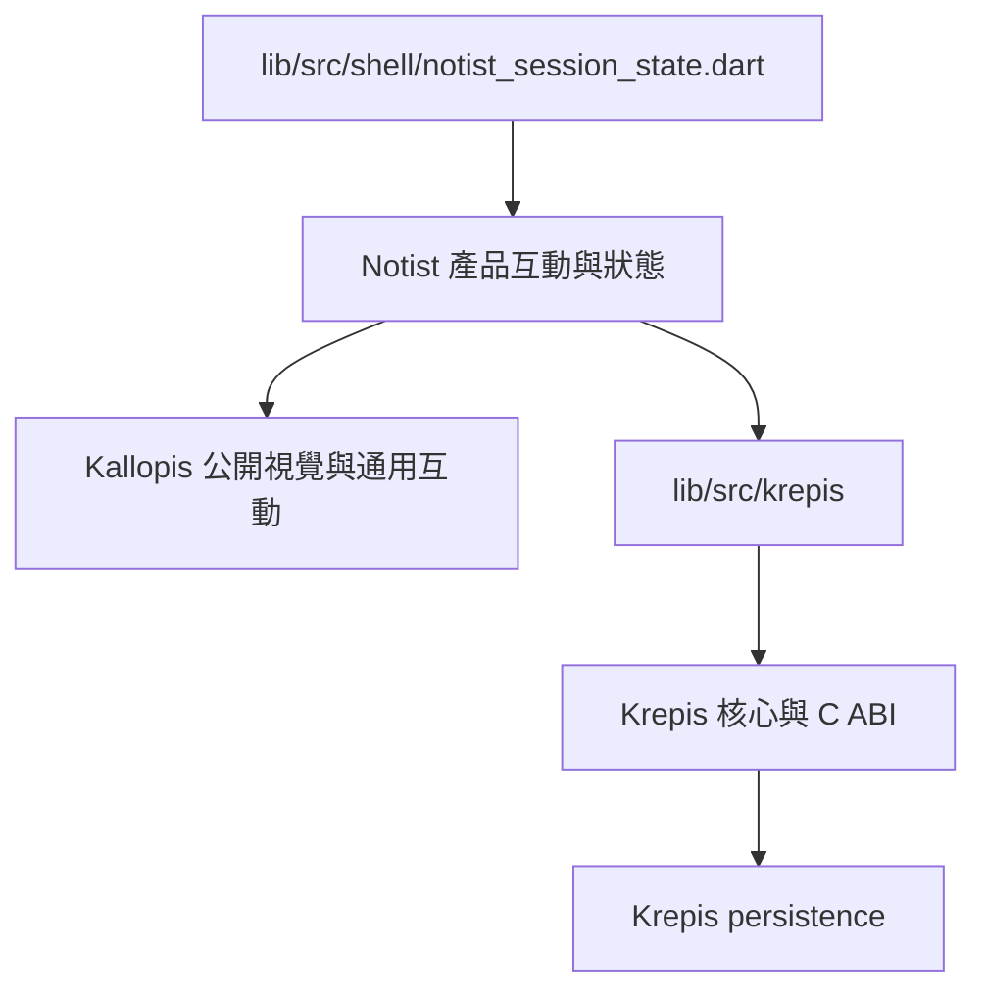

# Notist 功能里程碑修訂

狀態：Draft（2026-09-07；依使用者要求修訂流程與順序，尚未核准新的實作範圍）。
本次交付是規劃文件，不是新產品版本，也不表示下列功能已通過驗收。

本版依同日後續指示重新排序：Notist 暫停手寫、Krepis Ink 保留；不干涉 Kallopis；首版包含完整專案／筆記管理、單層資料夾、資料庫式巢狀頁面、自訂欄位、篩選、排序與多種視圖。詳細需求及待裁決設計見 [首版範圍](notist-v1-management-database-scope.md)，元件需求見 [Kallopis 缺口清單](notist-kallopis-component-gaps.md)。以下 M1–M11 取代本文件先前草案的 M1–M10 編號，不能沿用舊編號交接。

## 本任務分工

依使用者 2026-09-07 指示，本對話的協調者只負責討論、撰寫計畫、交接 prompt 與驗證規格，不撰寫產品或測試程式碼，也不自行啟動程式實作委派。實作執行者依人類交付的核准計畫完成核心、前端與測試；獨立驗收者執行驗證並提供原始證據，協調者據此整理差異、待修 prompt 與里程碑判定。

每步交接包含目標／動機、核准範圍、前後端路線、修改白名單、驗收案例、回報格式。協調者撰寫的驗證文件只定義如何檢查，不等於測試已執行；未取得完整實作與驗收結果前，不推進下一步。

## 目標與動機

供人類與後續實作者逐步交付可用的 Notist。每一步以完整使用者流程為單位，先規劃前端、核心／服務、資料契約與測試，再實作並驗證功能完整性，全部通過才能進入下一步。

目前 [工作區外殼計畫](plan.md) 與 [任務](todo.md) 是歷史 Completed 紀錄；不能代表整個產品完成。[能力地圖](../CAPABILITY-MAP.md) 保留責任與依賴，本文件作為修訂後的排程入口；本文件的新範圍不繼承舊文件的 Approved。

## 範圍

In：重新排序現有所需功能、補上串行閘門、建立追蹤清單；只展開第一步 M0 的執行計畫。既有功能先盤點與補驗，證據足夠的部分沿用，不要求重寫。

Out：本次不修改產品程式、不接受尚未核准的 ADR；不新增雲端服務或相依套件；不發布版本。Canva／Sheet、tabs、split、Secondary Sidebar／Inspector、多人協作與雲端同步仍在本輪之外。

凍結區：所有既有未提交程式、測試、golden、provider 修改與刪除狀態；Kallopis 全倉與依賴版本施工完全不介入。後續每步開工前記錄允許範圍的 HEAD、逐檔狀態與 SHA-256，取得該步白名單後才局部修改；不得整倉 reset、還原或代他人提交。Kallopis 缺件只寫清單，不能藉本步 provider 工作之名代修。

## 現況與修正依據

| 已查到的紀錄 | 對新里程碑的影響 |
| --- | --- |
| [Flow／Markdown 舊計畫](project-document-flow-and-markdown-plan-20260823.md) 要求 Flow 人工 checkpoint 全過才進 Markdown | M0 重新核對目前實際成品，不能跨過未完成 checkpoint |
| [Paragraph Windows 紀錄](../docs/verification/paragraph-dogfood-windows-2026-08-23.md) 仍有人工驗收待辦 | 歷史 machine gate 不能替代 IME、鍵盤與實機操作證據 |
| [能力地圖](../CAPABILITY-MAP.md) 記錄 Block delete 未有 provider command，Ink 工具與 session restore 不完整 | Block、恢復仍需完整交付；Ink 改為 Notist 首版停用且 Krepis 保留，取消手寫開發里程碑 |
| 同一能力地圖記錄搜尋僅標題／資料夾，Journal／資產／AI 是 empty shell | 保留入口；真實功能必須完成資料契約與端到端驗收 |
| [2026-09-04 遷移驗證](../docs/verification/kallopis-note-extraction-2026-09-04.md) 曾有非 golden 測試失敗與原生測試略過 | 屬歷史失敗線索，不推斷仍存在；M0 必須重跑目前版本確認 |

上述為文件盤點，不是 2026-09-07 runtime 測試結論。當前 provider 實際解析版本、功能覆蓋與完整 Verify 結果均待 M0 查證。

## 方案

本專案的「後端」首先是 Krepis 原生核心與本機持久化，不預設需要 HTTP 伺服器。需要遠端服務的功能，必須在該步明定服務 owner、認證、query／command、失敗與恢復契約。



Notist 擁有 route、專案組合、命令可用性、保存狀態投影與 AI session／proposal；Krepis 擁有內容、selection、transaction、undo、layout、persistence 與 Ink。Notist 的 session 偏好不保存第二份筆記內容。Kallopis 只能提供已核准公開入口的通用能力，本工作不修改其施工內容。

### 每一步必備的前後端完整計畫

| 計畫項目 | 開工前必須具體寫出 |
| --- | --- |
| 使用者流程 | 入口、操作、成功結果、空白／loading／unavailable／failure 與可恢復行為 |
| 前端路線 | 畫面、輸入、controller／adapter、route、命令可用性與顯示狀態；列明修改檔案 |
| 核心／服務路線 | 資料唯一 owner、公開 query／command、schema／ABI 版本、selection／revision、transaction 與 undo |
| 持久化與恢復 | 寫入成功定義、保存與重開、舊格式相容／拒絕、失敗原子性、重試與中斷恢復 |
| 串接契約 | UI → command → authority → persistence → projection 的完整路線；逐項查證 API 簽名與 provider gate |
| 測試與證據 | 每條需求對應測試／人工步驟、輸入、預期結果、負面路徑、真實 FFI、Windows 成品與截圖 |
| 邊界與回退 | 白名單、凍結區、依賴、未決問題、可驗證的完成條件與保留使用者資料的回退方法 |

不適用項目須附理由，不能留白。需要的 provider API 尚不存在時，先規劃並驗收提供者契約，再串接 Notist；不能在 Flutter 補造核心真相。

Kallopis 為上述提供者流程的凍結例外：只能列元件缺口並等待其施工方交付，不能在 Notist 任務中修改其元件／公開 API／相依版本。完整資料庫不可在未裁決 owner 前於 Flutter 複製筆記 metadata 或持久化真相。

### 串行閘門

狀態依序為：Queued → Planning → Awaiting approval → Implementing → Verifying → Complete；遇到失敗轉為 Needs fix，依賴或核准缺失則為 Blocked。Needs fix／Blocked 均不能讓下一步啟動。

1. 前一步 Complete 才能展開下一步完整規劃；後續目錄不是開工授權。
2. 規劃必須涵蓋上述全部路線，經人類明確核准適用範圍才進實作。已有明確核准且範圍不變時，引用原核准，不重複索取同一授權；新增範圍或改契約需補核准。
3. 同一步內由實作執行者依序完成 provider 契約與測試、consumer 接線、整合與恢復測試；這些是同一流程的執行階段，任何階段完成都不能單獨宣稱該功能完成。
4. 對本步每條驗收條件及前面已完成流程跑必要回歸；保留完整指令、環境、尾行、exit code、失敗／略過項目。必要案例有任何失敗、略過或未查證，不能標 Complete。
5. 每個可交付版本必須編譯出可執行成品，在 Windows 目標實機啟動該成品，逐項操作並保存實際截圖。記錄成品路徑與 hash、provider 版本、資料 fixture、結果與截圖對應；widget／golden／mock 與舊截圖不能替代。
6. fresh-context 驗收者獨立核對需求、親自執行適用測試並檢查證據；使用者操作才能確認的案例需取得實際操作結果。同步完成證據後才可勾選 Complete。無法取得證據就記 Blocked，不降低標準。
7. 卡住只能修復本步或處理本步必要 provider 依賴。調整順序或延後範圍須記錄原因、影響並取得核准，不得直接跳做下一功能。

## 分步實作清單

### 里程碑目錄（M1 起僅列方向，輪到時才展開完整規劃）

| 步驟 | 使用者可完成的流程 | 前端／核心或服務路線方向 | 出關重點與前置閘門 |
| --- | --- | --- | --- |
| M0 | 停用 Notist 手寫後完成現有 Flow 編輯、保存、重開與失敗恢復 | Notist 輸入政策／Stage／save projection ↔ Krepis editing／persistence；保留 Ink 核心 | 先完成 M0.a–b；舊 Ink 資料不丟失，Kallopis 不改動 |
| M1 | 建立、進入、切換與刪除專案，重開後資料隔離正確 | Notist 專案入口／管理 UX ↔ 待 ADR 的 registry／lifecycle 與 Krepis 文件資料 | M0；區分建立專案與建立筆記，處理 pending save／取消／刪除失敗與恢復 |
| M2 | 管理單層資料夾與筆記：建立、命名、編輯、釘選／取消、移動、刪除與重開 | Notist Explorer／選單／Stage ↔ 筆記 metadata／pin／folder／delete／persistence owner | M1；釘選獨立於選取；拒絕巢狀資料夾，先鎖定舊資料遷移與非空刪除政策 |
| M3 | 建立資料庫頁面記錄及巢狀子頁，移動、開啟、刪除後重開 | Notist 子頁導覽／基本記錄清單 ↔ page identity／parent relation／集合歸屬與持久化契約 | M2；owner ADR、schema 歸屬、循環禁止、子樹刪除／恢復；同記錄開啟同筆記 |
| M4 | 自訂欄位與記錄值：建立、修改、轉型、刪除、保存重開 | Notist 欄位／值編輯 UX ↔ schema／typed value／migration／atomic command | M3；各核准型別與無效值驗收，改型失敗不得丟資料 |
| M5 | 建立並保存組合篩選、多欄排序，清除後找回全部記錄 | Notist query UI／結果 ↔ typed query／stable ordering／配置保存 | M4；空值、同值、階層匹配、刪欄後 query 處理及重開 |
| M6 | 用多種視圖管理同一資料庫，跨視圖編輯與重開 | Notist 視圖配置與呈現 ↔ 同一記錄／revision／query 與視圖配置 owner | M5；核准視圖矩陣、跨視圖一致性與缺元件閘門；M3–M6 全過才稱完整資料庫 |
| M7 | 操作 Block 與 Todo，撤銷後保存重開 | Notist 共用 command registry ↔ Krepis selection／move／delete／convert／Todo／codec | M6；Block command 與 persistence gates；不得模擬 provider delete |
| M8 | 貼上或匯入 Markdown，再編輯、撤銷、保存重開 | Notist clipboard／file intent／diagnostic ↔ Krepis parser／atomic apply／marks／persistence | M7；支援矩陣、來源保護、錯誤與原子性 |
| M9 | 依偏好恢復專案、筆記、階層展開、視圖與工作位置 | Notist session／route ↔ 穩定位置、資料庫配置與 Krepis caret projection | M8；資料刪除、移動與無效 session fallback |
| M10 | 搜尋專案筆記並定位原頁面／Block | Notist query／結果／route ↔ Krepis index／query／stable identity | M9；search owner gate、巢狀頁面／釘選／刪除後索引一致 |
| M11 | 安裝包含首版管理與完整資料庫的可用版本 | Notist Windows 封裝／啟動 ↔ 固定 provider／舊資料相容 | M10；全流程回歸、成品實機、升級回退、Kallopis 缺件無必要阻塞 |

Journal、資產管理、AI 讀取／Proposal、協作、Canva／Sheet、其他平台與 Notist 手寫恢復改列後續未排程目錄。Krepis Ink 持續保留，不是刪除或重做項目。M1–M6 是本次新增的首版必要主線；詳細型別／視圖／刪除規則仍須逐步鎖定，不能以部分資料庫能力宣稱首版完成。

### M0：Notist 手寫停用與 Flow 完整流程收斂（第一步詳細計畫）

目標：用目前實際 provider 與產品成品證明最小可用筆記流程；補齊缺口，不重新實作已存在的功能。M0.a–b 屬規劃補全；本草案或順序的核准不授權 M0.c–e 實作。M0.b 須逐項對照既有核准，補齊未覆蓋範圍的明確實作核准，才能交付實作者。M0 不以開機即恢復上次 caret 作為前提，先驗證明確開啟同一文件；自動恢復完整性留在 M9。

前端：沿用 [project controller](../lib/src/project/notist_project_controller.dart)、[project store](../lib/src/project/notist_project_store.dart)、[Flow editor](../lib/src/krepis/notist_flow_editor.dart)、[save projection](../lib/src/krepis/notist_local_save_projection.dart) 及 `lib/src/sidebar/`、`lib/src/stage/`，核對真實 ID、標題、輸入、內容投影與狀態。

核心：逐項查讀 `lib/src/krepis/` 已使用的 FFI 宣告與實際解析的 Krepis provider 公開入口，建立 create／list／open／rename、文字編輯、selection、undo／redo、save／load 與錯誤結果契約表。以上為操作語意，並非新 API 名稱；精確符號、簽名、版本與來源行號須在 M0 實作前補入記錄，尚未核對的標「未查證」。Krepis 倉庫位置與使用版本以當次解析結果為準，不能以 sibling 存在推定已被消費。

資料路線：UI 輸入 → Notist command／adapter → Krepis transaction／accepted revision → Krepis 保存結果 → Notist 狀態與 Explorer／Stage 投影。重開時由真實持久化資料重新載入；拒絕的操作不更新成功投影，保存失敗保留最後成功資料並允許明確 retry。

| 執行階段 | 工作與檔案邊界 | 本階段證據 |
| --- | --- | --- |
| M0.a 基線與契約核對 | 記錄 Notist 及實際 providers 的 HEAD／dirty delta／hash、dependency pin、DLL；讀既有測試與歷史七項人工驗收。新增 M0 執行記錄於 `docs/verification/` | 每個必要操作有 frontend → provider → persistence → projection 對照，差異與未查證清單；若需改 Krepis，先列該倉精確白名單與核准範圍；Kallopis 只列缺口，不納入白名單 |
| M0.b 完整計畫鎖定 | 將 M0.a 查到的精確 API、待修檔案、失敗案例與回退加入本步記錄；對照既有核准，新增範圍送核准 | 所有必要契約已查證或列入同一步 provider 修復計畫；無未裁決的實作前提 |
| M0.c 補缺口與串接 | 實作者只修本步核准的 Notist 手寫停用／editor／save 路線與對應測試；保留 Krepis Ink；Kallopis 缺件則記錄阻塞 | provider contract、原生 consumer、widget 及保存／重開測試結果；既有可用行為沒有回歸 |
| M0.d 功能完整性驗收 | 對照下節 A1–A9 執行完整 Verify、Windows 成品操作與保存失敗／retry；寫 M0 記錄與 `docs/verification/evidence/` 截圖 | 指令與 exit code、逐案例結果、成品與 provider hash、實機截圖；缺一不得通過 |
| M0.e 獨立驗收與狀態同步 | fresh-context 驗收者檢查實際資料、測試、成品與工作樹差異，更新本步追蹤 | A1–A9 全過及驗收記錄；才能標 M0 Complete，開始 M1 Planning |

M0 對應既有測試入口：[lifecycle](../test/flow_project_lifecycle_test.dart)、[composition](../test/project_paragraph_composition_test.dart)、[editor lifecycle](../test/notist_flow_editor_lifecycle_test.dart)、[save state](../test/save_state_projection_test.dart)、[provider identity](../test/krepis_abi_identity_test.dart)。存在測試不表示已通過，也不表示它覆蓋下面全部案例。

已核對 [唯一 Verify](../tool/verify.ps1) 的參數；M0 驗證指令如下（本次文件修訂未執行）：

```powershell
pwsh.exe -NoProfile -ExecutionPolicy Bypass -File tool/verify.ps1 -FlutterPath C:\development\flutter\bin\flutter.bat -BuildWindowsRelease
```

該入口包含依賴檢查、格式、分析、Windows Debug build、啟用原生路徑的 Flutter tests 與可選 Release build；它不包含實機互動驗收，也不能替代所修改 provider 的唯一 Verify。提供者檢查指令先查實際倉庫入口再記錄，禁止猜測。

## 驗收條件

### M0 功能驗收（目前全部待執行）

| ID | 誰／方法 | 可判定的通過結果 |
| --- | --- | --- |
| A1 | 驗收者在 Windows 成品使用隔離的既有本機資料目錄建立兩份 Flow、重新命名與切換 | 不同 stable ID；標題與 Explorer／Stage 對應同一資料；中央始終單一 Stage，無假 notes／Saved；此項不宣稱 M1 專案管理已完成 |
| A2 | 驗收者使用真實 FFI 完成繁體中文 IME、組字取消／提交、Enter split、Block 開頭 Backspace merge、選取、undo／redo | 提交文字恰好一次、取消不產生內容、順序／caret／選取與撤銷結果符合 fixture；歷史 P1 七項逐項補記，不能只用合成鍵盤事件 |
| A3 | 驗收者保存兩份不同內容，關閉程序、啟動同一成品並明確開啟兩文件 | ID、標題、UTF-8 內容與順序都與保存前一致，文件內容不串接；載入來自真實磁碟資料 |
| A4 | 測試者在隔離資料 fixture 造成可重現保存失敗，再恢復可寫入並 retry | UI 顯示 failed；最後成功檔 hash 不變；retry 成功後才顯示 saved；重開得到 retry 後內容 |
| A5 | 測試者以 fixture 覆蓋 stale revision、損壞／未知版本文件及缺失來源 | 拒絕或依已核准相容契約處理，有明確錯誤／恢復入口；不靜默重置、不覆寫原檔、不產生假成功；各類型記錄精確預期 |
| A6 | 獨立驗收者執行 Notist 唯一 Verify、必要 provider gates 與既有功能回歸 | 適用檢查 exit code 0、必要案例零失敗零略過；固定真實 DLL／provider 與本次成品對應，無放寬門檻或刪測試過關 |
| A7 | 獨立驗收者核對並啟動本次 Windows 可執行成品 | 成品存在、hash／依賴／環境可追溯；A1–A5 及 A8 的操作記錄與實機截圖可對應，不以 screenshot 單獨證明持久化或 transaction |
| A8 | 驗收者檢查 Notist 全部 Ink 入口、快捷鍵、stylus 與含 Ink 舊檔 | Notist 不產生新 stroke；Krepis Ink ABI／codec／核心能力不刪改。按 M0.b 核准政策保留舊 Ink 後保存，或明確唯讀／禁止覆寫；前後資料比對證明無遺失 |
| A9 | 獨立驗收者查對本步修改清單、依賴與 Kallopis 缺口紀錄 | 本任務沒有修改 Kallopis、patch 快取、升降其依賴或委派施工；只用核准公開元件。必要元件缺件尚未交付／消費端驗收時保持 Blocked，不降低完整性要求 |

### 本次規劃文件驗收

- 文件明確列出新順序、每步完整前後端計畫欄位、核准／實作／測試／實機／獨立驗收閘門。
- 只有 M0 展開詳細路線，M1 以後維持目錄；追蹤清單不預勾功能完成。
- 入口連結指向本文件與新追蹤清單；歷史核准、完成與使用者未提交變更保留。
- Markdown 存在、非空與相對連結 read-back 通過，並完成獨立文件審查；不以文件驗收冒充產品驗收。

## 風險與回退

| 風險 | 偵測訊號 | 應對 |
| --- | --- | --- |
| 文件、pin 與工作樹不一致 | ABI／測試／元件 ownership 記錄互相矛盾 | M0.a 以當次解析與實際檔案為準，保留歷史記錄並標差異；不自動升降 provider |
| 以 UI 可見或歷史測試視為完成 | 缺 FFI／保存重開／失敗恢復／成品操作證據 | 維持 Verifying／Blocked，補齊本步；禁止提前進入後續里程碑 |
| 單步過大或 owner gate 未定 | 本步新增多個未決契約、不能獨立驗收 | 先修訂成可獨立完成的使用者流程，補前後端完整計畫並核准；不得用只完成一層拆步 |

回退只撤回本次自己新增的文件段落或該步可辨識 patch；資料變更使用已核准備份／相容方案，保留原始文件與其他人的 dirty delta。

## 待裁決問題

Q1. 本里程碑順序是否符合目前優先需求？本次只討論順序與 M0.a–b 規劃核對，不申請尚未形成完整細節的程式實作授權。M0.c–e 須在 API、修復白名單、fixture 預期與完整前後端計畫鎖定後，引用逐項既有核准並對未覆蓋部分取得明確實作核准。核准沒有預設值；若修改順序或發布範圍，先更新本文件。

後續步驟的 owner、服務選型、API 與具體驗收數值，在前一步 Complete 後逐步規劃裁決；本次不一次展開全部實作內容。
