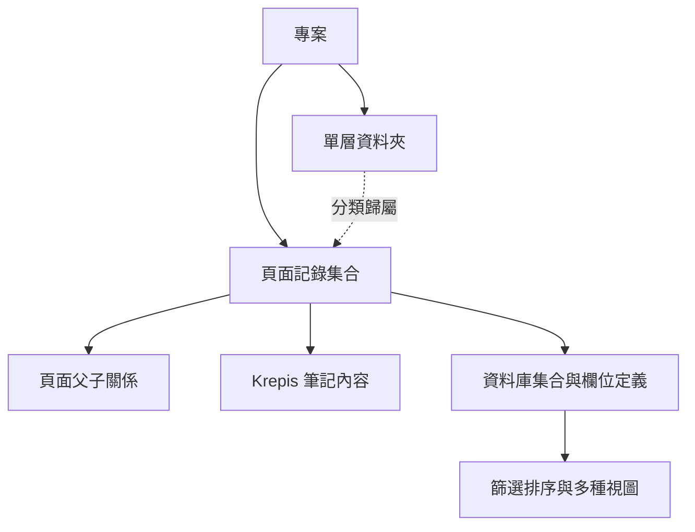

# Notist 首版：專案、筆記與資料庫範圍修訂

狀態：Planning（2026-09-07）。使用者已明確要求本節「已確認需求」；資料模型、刪除語意與具體視圖組合仍是設計提案，不能視為實作核准。
協調者只討論、撰寫計畫、prompt 與驗證規格；本次不修改產品、測試或任何 provider 程式。

## 目標與動機

第一版以能管理自己的專案、筆記與資料庫為主線。建立、進入、編輯、組織、刪除、保存與重開都必須接到真實資料，不以頁面入口或展示資料宣稱完成。此修訂優先於先前將 Ink、Journal、資產與 AI 排入首版路線的草案。

## 已確認需求

1. Notist 第一版暫時移除手寫功能；Krepis 保留 Ink 能力。
2. Kallopis 正在施工。本工作不得修改、代修、重構、升降依賴或委派它的施工；缺元件只寫 [元件需求／缺口清單](notist-kallopis-component-gaps.md)。
3. 完整專案管理至少包含建立、進入與刪除專案。
4. 完整筆記管理至少包含建立、編輯、釘選／取消釘選與刪除筆記。
5. 資料夾不可巢狀；頁面可以巢狀，而且採資料庫形式。
6. 使用者已選擇完整資料庫能力：自訂欄位、篩選、排序與多種視圖。不能降成只有固定欄位的子頁清單。
7. 每一步先完整規劃前後端路線，再由實作者實作、測試並交回證據；功能完整性驗收通過才開始下一步。

## 範圍與凍結區

In：首版功能清單、資料架構提案、前後端責任與驗證重點、Kallopis 缺件紀錄及里程碑重排。詳細步驟仍只展開當前 M0，後續維持目錄。

Out：本次不寫程式；Notist 首版不啟用 Ink；不增加 Canva／Sheet runtime；Journal、資產管理、AI、協作與其他平台列後續目錄，不因過往草案而自動成為此次首版必要交付。

整個 Kallopis 工作樹、公開 API、測試、golden 與施工中的版本均為凍結區。已有公開元件可按當步核准的固定版本消費；如該版本缺少必要能力，記錄阻塞或提出只用現有通用元件的產品組合方案，不能自行補造一套共用元件庫。

### 手寫停用與資料保護

Notist 不提供手寫入口、Ink 工具列、工具快捷鍵或 stylus 自動建立 stroke；隱藏按鈕但保留輸入觸發不算移除完成。Krepis 的 Ink ABI、codec、資料及核心測試不刪除、不降級。

既有含 Ink 文件的處理提案：以不遺失資料為前提。若提供者已證明可保留未編輯 Ink，Notist 才能允許編輯文字並保存；尚不能證明時顯示不支援／唯讀並禁止覆寫，保留原檔。是否需要唯讀 Ink 顯示另行裁決，不能因停用手寫而靜默清空 stroke。此提案須在 M0 鎖定為可驗收契約。

## 現況差距

| 查到的來源 | 現況與新需求的差距 |
| --- | --- |
| [Project store](../lib/src/project/notist_project_store.dart) | 現有 listFlows／listFolderPaths／allocateFlowPath 與遞迴目錄掃描，不等於完整專案／筆記刪除與管理契約 |
| [Sidebar explorer](../lib/src/sidebar/notist_sidebar_explorer.dart) | 現有資料夾投影遞迴；釘選區依 selectedRootId 分組，不能表示持久化的使用者釘選 |
| [NTS-0004](../spec/decisions/NTS-0004-folder-acl-and-restricted-projection.md) | 歷史提案採 Folder 可巢狀；需另立決策明確取代該結構假設，不直接改寫歷史決策為已核准 |
| [NTS-0002](../spec/decisions/NTS-0002-page-kinds-and-note-capabilities.md) | 仍是 Proposed；資料庫表格視圖不能直接推定為 Sheet runtime 已核准 |

以上是源碼／文件盤點，不是當前功能測試通過證據。資料庫 query、schema、父子關係與 pin 的完整 provider 契約尚未查證。

## 資料架構提案（待鎖定）

此圖是新領域模型提案，不是宣稱已有同名模組或 API。

- **專案**是資料隔離邊界，有穩定 ID 與持久化入口；切換、刪除不得影響其他專案。
- **資料夾**只在專案下一層，不含子資料夾。建議允許未分類根頁面；空資料夾也能保存。是否移動／改名／刪除與非空處理在 M2 完整定義。
- **頁面／筆記**採同一穩定 ID，內容由 Krepis 持有；改標題、釘選、換視圖或改父頁都不能複製內容或改 identity。
- **巢狀頁面**用父頁關係表達，不由磁碟資料夾路徑推導。建議每頁最多一個父頁，禁止 self-parent、循環與跨專案父子關係；子樹繼承根頁的資料夾歸屬，避免兩種分類互相衝突。這些為待核准約束。
- **資料庫集合**定義成員頁面、欄位 schema 及視圖。集合歸屬與父子關係是不同概念；需在 M3 規格明定「整棵子樹共用 schema」或「各子集合獨立 schema」，以及跨集合移動的欄位保留／映射／拒絕規則，不能自行假定。
- **資料庫記錄就是頁面**；清單、表格、看板等只是同一記錄的投影，打開記錄仍進入同一 Stage 編輯原筆記。
- **自訂欄位**有穩定欄位 ID、型別、值與版本；名稱不作 identity。型別初步提案包含文字、數字、核取、日期、單選、多選；轉型、刪欄與無效值不得悄悄丟資料。
- **篩選與排序**為持久化 query 規則，至少規劃 AND／OR 組合、依欄位型別的運算子、多欄位排序、空值與同值穩定次序。套用篩選不刪除記錄，階層頁面是否顯示匹配子頁／祖先須明定。
- **視圖**初步提案為表格、清單、看板、日曆；各視圖保存自己的篩選、排序與顯示欄位。看板分組須有對應欄位，日曆須有日期欄位；缺欄位顯示設定入口，不能假造資料。具體視圖組合待確認，不能只交一個表格算多種視圖完成。

此處「完整資料庫」至少涵蓋使用者列出的四類能力；公式、Relation／Rollup、圖表、自動化、外部同步等未被明確要求，先列待討論擴充，不假定承諾全部 Notion 功能。

## 前後端責任與契約閘門

| 範圍 | Notist 路線 | 核心／持久化路線與前置條件 |
| --- | --- | --- |
| 專案生命週期 | 專案清單、建立／進入／切換／刪除、目前 Stage 與錯誤恢復 | 專案 registry、路徑與生命週期協調 owner 需 ADR；筆記內容仍只由 Krepis 管理 |
| 筆記、資料夾、階層 | 建立／命名／編輯／釘選／刪除、階層導覽與操作結果 | 已知筆記內容／metadata、transaction 與 persistence 由 Krepis 持有；新增 folder／pin／parent relation 的 owner 待 ADR，若缺契約先在核准 owner 規劃，不在 Flutter 存第二份 truth |
| 資料庫 schema 與記錄值 | 欄位編輯器、型別選擇、值輸入與 diagnostic | 新增結構化資料 owner 決策；建議與筆記 authority 整合，具體模組／schema／ABI 待查證與核准 |
| query／多種視圖 | 視圖配置、query UI、開啟原頁面、empty／loading／failure | query 必須讀同一 canonical 資料與 revision，視圖設定存放 owner 需明定；前端不得各留一份資料列真相 |
| Kallopis | 只消費已發布／核准公開元件，Notist 組合產品行為 | 不新增其 API 或修改其工作樹；缺少能力只記缺件，等待交付後再獨立驗收消費端 |

每個寫入都規劃「輸入 → 命令 → owner 驗證 → transaction → 保存結果 → 投影」，每個讀取都規劃載入、版本、空資料與錯誤恢復。精確 API 尚未查證之前不發出實作 prompt。

### 刪除與遷移提案

建議專案與筆記的「刪除」先進可恢復狀態；永久刪除另外確認。父頁含子頁、專案含筆記、資料夾含頁面時，先顯示影響範圍，核准級聯刪除或先移出後再刪除的規則。這是待討論的產品行為，不是本次檔案刪除授權。

恢復需保留 ID、內容、父子關係、欄位值與釘選；刪除後清除失效 route／pin／搜尋結果，當前頁面轉明確 empty。部分寫入失敗需原子拒絕或可重試恢復，不得顯示成功卻留下半棵樹。

現有磁碟巢狀資料夾需有版本化遷移計畫：先備份、預覽 mapping、處理同名碰撞、保留頁面 stable ID、失敗回退。不得直接把深層路徑裁成一層或刪去舊內容。新建資料從第一天遵守單層限制；舊資料未完成遷移時明確只讀／不支援，不靜默改寫。

## 里程碑目錄與驗證重點

完整排序見 [里程碑主計畫](notist-functional-milestones-20260907.md)。以下只定義各類需求的最低證據，輪到該步才展開全部案例。

| 功能 | 功能完整性必驗 |
| --- | --- |
| 手寫停用 | Notist 入口／快捷鍵／stylus 都不建立 Ink；Krepis Ink 能力保留，含 Ink 舊檔不得因文字保存遺失資料 |
| 專案管理 | 建立兩專案→分別進入→資料互相隔離→刪除其中一個→重啟；取消與寫入失敗不改原資料 |
| 筆記管理 | 建立／改名／編輯→釘選與取消→切換筆記→重開→刪除；釘選不跟 selected ID 改變，確認取消無副作用 |
| 單層資料夾 | 建立／改名／移動筆記／刪除依規格完成；拒絕第二層資料夾；重啟與舊路徑遷移不遺失頁面 |
| 巢狀頁面 | 建立至少三層頁面→移動父頁／子樹→重開；循環、跨專案與已刪父頁被拒絕；資料庫記錄開啟相同 page ID |
| 自訂欄位 | 新增／改名／改型／刪除欄位→輸入各核准型別→重開；失敗不部分套用，舊值保留／轉換結果可驗證 |
| 篩選與排序 | 組合條件、多欄排序、空值／同值、階層匹配與 schema 變更；重開配置一致，清除篩選後記錄仍存在 |
| 多種視圖 | 同一資料庫在每個核准視圖查看與編輯同一頁面；切換後值／ID／revision 一致，無複製或漏失；視圖設定持久化 |
| 全流程與依賴 | 真實 provider、保存失敗／retry、重啟、舊資料、Windows 成品與逐流程截圖；Kallopis 零工作樹修改，缺件未關不得假驗收 |

## 風險與回退

| 風險 | 訊號 | 應對 |
| --- | --- | --- |
| 新資料模型與舊 Folder ACL／path 假設不相容 | 父子關係或權限還以磁碟深度推導 | 先立決策與遷移契約，舊資料保持可回退 |
| 完整資料庫範圍失控 | 把所有 Notion 功能當作首版承諾 | 鎖定欄位型別與視圖矩陣；缺項列明，不以展示頁縮水交付 |
| Kallopis 施工阻塞 | 必要元件／公開契約尚未可用 | 只列缺件與受阻里程碑；等待提供者交付，不能進其倉代修或跳步 |

回退只撤回本次文件增量；日後程式與資料遷移依各步核准方案回退，保留 Krepis Ink 與全部既有資料。

## 待討論設計（本次不擅自定案）

- 資料庫集合與父子頁面的 schema 繼承規則、跨集合移動規則及新增資料模型 owner。
- 欄位型別與視圖清單；上述六種型別、四種視圖為提案。
- 刪除／復原／永久刪除、子樹影響範圍與 Ink 舊檔唯讀呈現政策。

這些會影響驗收，必須在對應步驟完整計畫核准前確定；目前的明確需求可先更新里程碑，不因設計細節未決而延誤文件修正。
