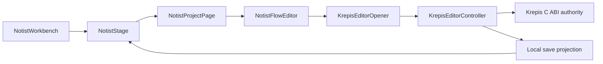

# paragraph-dogfood-integration 實作計畫

狀態：Implementation Complete（2026-08-23；Windows 人工 IME／shortcut 驗收待完成）

## 目標與動機

將已完成但仍隔離的 Krepis Paragraph editor 接進 Notist Project Stage，建立第一個真實可輸入、可暫存、
可重開的垂直切片。同時以明確 dogfood 文案與失敗狀態避免把暫存 codec 冒充正式 MVP persistence。

## 範圍

### In

- 可注入的 open request／opener 與明確 dogfood path。
- 空白初始化、loading、load error、retry、save projection 與 save retry。
- Project Stage production composition、focused widget tests、Windows 實機驗收。
- Notist-owned local Flow project lifecycle：空專案、新增、列出、stable root selection 與標題投影。
- Krepis Flow root／首段標題 C ABI projection 與 ABI minor 安全。
- Flow prototype 解除 native coupling，保留純 Catalog fixture。
- 固定日期、官方來源優先的 Notion Block 行為基準。

### Out

- 正式 P4 persistence／migration、Page metadata、Folder 與獨立 rename command。
- Block／Todo／Ink／Search／AI runtime、Canva／Sheet prototype 與 Kallopis API 變更；Krepis 僅限
  已核准的 Flow root／首段標題投影與 C ABI 1.1。

## 方案

Composition root 建立同一份 `KrepisEditorOpenRequest` 與 save projection，Stage 將 Project route 交給專用
Project page。Widget tests 只替換 opener 的 pending／throw 邊界；真實 ready path仍由 Windows native gate 驗證。

## 分步實作清單

1. **PDI-B baseline**：記錄三倉 HEAD/status 與計畫修改檔 hash。證據：逐檔 hash／absent 清單。
2. **PDI-0 behavior baseline**：寫入官方可驗證規則及未查證矩陣。證據：每列含日期、平台、來源、狀態。
3. **PDI-1 RED lifecycle tests**：新增 composition、open lifecycle、save projection tests。證據：因缺新 contract 而 RED。
4. **PDI-2 open contract**：新增 request/opener/authority seam，controller 改成 required path＋blank initial text；Flow prototype 改為純 fixture。證據：request tests GREEN、Catalog 不載 native。
5. **PDI-3 honest editor lifecycle**：loading、load failure、retry、stale future dispose。證據：lifecycle tests GREEN。
6. **PDI-4 save projection**：native save attempt 驅動 saving／success／failure；failure 可 retry。證據：projection tests GREEN。
7. **PDI-5 production composition**：新增 Project page並接入單一 Stage。證據：route tests GREEN，非 Project 不掛 editor。
8. **PDI-6 visual baseline**：主 Golden 固定 editor loading fixture，不建立 fake ready authority。證據：更新後 Golden test GREEN 並人工檢視。
9. **PDI-7 verify**：focused tests、唯一 Verify、Windows native/manual、fresh-context review。
10. **PDI-8 lifecycle hardening**：文件 session save retry、create/load 競態、duplicate root、high-bit ID 與
    ABI version fail-closed。

## 驗收條件

- 逐條採 `SPEC-paragraph-dogfood-integration.md` 的九項 acceptance criteria。
- 至少一條 corrupt/load failure 與一條 save failure 負面路徑有證據。
- Kallopis、prototype pages 與既有 Catalog 不產生本批 delta；Krepis delta 僅限 DOC-0004 root/title
  projection、C ABI version 與其測試／文件。

## 風險與回退

| 風險 | 偵測訊號 | 應對 |
|---|---|---|
| dogfood 被誤認正式格式 | UI 出現一般化 Saved／正式文件字樣 | 強制 dogfood 文案與負面測試 |
| save 失敗後記憶體與檔案分岔 | mutation 成功但 native save throw | refresh snapshot、failed＋retry，不宣稱 rollback |
| widget fake 越過 authority | 測試建立 fake snapshot／revision | 測試只 pending／throw 或純 projection |

整體回退：移除 Project page composition，恢復已驗收的 Project empty state；不刪除任何 dogfood 檔案。

## 待裁決問題

無。本切片不建立 Page kind／正式文件 identity；使用者已授權全部目前可交付範圍。
實作與驗證證據見 [`docs/verification/paragraph-dogfood-windows-2026-08-23.md`](../docs/verification/paragraph-dogfood-windows-2026-08-23.md)。
