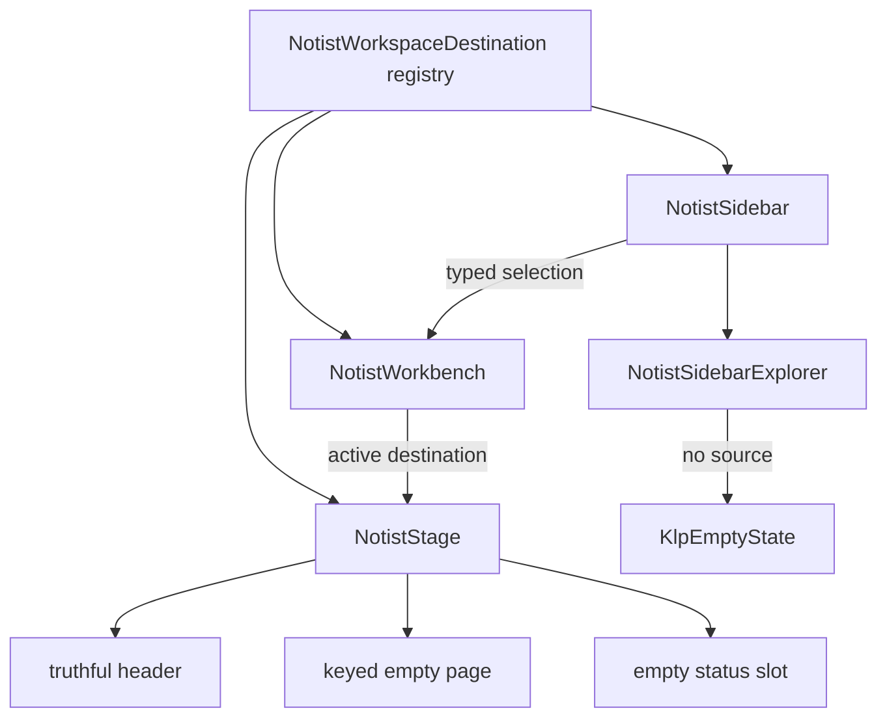

# workspace-shell-routing 實作計畫

狀態：Completed（2026-08-23；Q1 A、Q2 A、Q3 A 全部驗收通過）

## 目標與動機

把現有展示型 Workbench 收斂成 Notist 的真實工作區邊界：正確固定導覽、單一 Stage、空 FileExplorer 與誠實的未完成狀態。若不先完成，後續文件 lifecycle、Block、Ink 與 AI 會繼續接在假 note ID、假 page kind 與固定 `Saved` 上，造成 UI 通過但資料契約不存在的假綠燈。

## 範圍

### In

- 記錄 capability map 的核准狀態，並讓 `AGENTS.md`／`README.md` 與已確認產品定位一致。
- 新增五個 typed workspace destinations 及唯一順序。
- 重組 Primary Sidebar、empty FileExplorer 區域與單一 Stage。
- 為五個入口提供獨立 keyed empty／unavailable page。
- 移除 production runtime 的 hard-coded notes、Flow／Canva／Sheet route 推定、假 Breadcrumb、假 `Saved` 與假統計。
- 重寫直接鎖定上述 contract 的 unit／widget tests，並在核准後更新主畫面 golden、把 Canva／Sheet golden 遷成隔離 prototype fixture。

### Out

- 不建立專案／文件 lifecycle、標題編輯或真實 FileExplorer 資料。
- 不實作文字編輯、Block selection、Slash Menu、Todo 或 Ink。
- 不實作 Quick Search 索引、Journal 排程、資產資料或 Notist AI runtime。
- 不改 Kallopis、Krepis、FFI、native runner、dependency、ADR 狀態或正式 persistence。
- 不新增 tabs、split、Secondary Sidebar 或 Inspector。

## 方案

Notist 用單一 `NotistWorkspaceDestination` registry 供應 Sidebar、Workbench 與 Stage。Workbench 只保存目前固定目的地；Sidebar 發出 typed destination；Stage 根據同一型別呈現 header 與唯一 keyed empty page。Explorer wrapper 在沒有資料 source 時顯示 `KlpEmptyState`，未來由 `project-document-lifecycle` 注入 sections 後才建立 `KlpFileExplorer`。

Kallopis 與 Krepis 本批零改動。Flow／Canva／Sheet production route 被移除，但 prototype 檔案與 Catalog 保持不動。

凍結區：Kallopis、Krepis、`lib/src/krepis/**`、`lib/src/note/**`、三個 prototype page、`lib/catalog/**`、平台 runner、dependencies 與 NTS ADR。

## 分步實作清單

1. **WSR-B：擷取開工基線。** 在任何實作 patch 前，將三倉 `HEAD`／`git status --short`、全部計畫修改檔 SHA-256、Notist 凍結區 SHA-256、實際消費的 Kallopis 公開檔 SHA-256 保留在任務執行紀錄。完成證據：每個目標都有路徑、存在狀態與 hash；未追蹤檔也有 hash。
2. **WSR-0：同步治理入口。** 修改 `AGENTS.md`、`README.md`；保留現有 rename／Catalog／Verify 內容，移除過時定位與 spike gate。完成證據：兩份文件一致描述 Notist、Kallopis、Krepis ownership，且不再聲稱「尚未進入實作」。
3. **WSR-1：建立 destination contract。** 新增 `lib/src/shell/notist_workspace_destination.dart` 與 `test/workspace_destination_test.dart`。完成證據：測試精確驗證五項順序及 ID／label 唯一。
4. **WSR-2：建立誠實 Sidebar。** 修改 `lib/src/sidebar/notist_sidebar.dart`、`lib/src/sidebar/notist_sidebar_explorer.dart`、`test/workbench_layout_test.dart`。完成證據：五個全寬入口、empty Explorer、無 hard-coded note；此步先用最小 host 驗證 Sidebar。
5. **WSR-3：接上單一 Stage。** 修改 `lib/src/shell/notist_workbench.dart`、`lib/src/stage/notist_stage.dart`、`test/workbench_layout_test.dart`、`test/note_page_types_test.dart`、`test/note_page_visual_golden_test.dart`。完成證據：五個入口切換唯一 keyed page，status slot 非 null，沒有 prototype、假 Breadcrumb、假 status 或 secondary pane；Canva／Sheet visual fixtures 不再依賴 production route。
6. **Checkpoint：行為契約。** 執行相關 unit／widget tests，人工 read-back production imports，確認三個 prototype page 只被 Catalog／prototype tests 引用。
7. **WSR-4：更新視覺基準。** 在使用者核准後更新 `test/goldens/notist_main_visual.png`、`notist_canva_page.png`、`notist_sheet_page.png`。完成證據：主畫面顯示五入口、空 Explorer、單 Stage且無假資料；後兩張只包含隔離 prototype fixture；不放寬比較或刪測試。
8. **WSR-5：唯一 Verify 與差異審查。** 執行 `pwsh.exe -NoProfile -ExecutionPolicy Bypass -File tool/verify.ps1`，接著比較開工前後 worktree／hash 快照。完成證據：exit code 0、測試輸出尾行、無新增的凍結區 delta。

詳細 acceptance、verification、dependency 與檔案清單見 `tasks/todo.md`。

## 驗收條件

1. 測試精確讀到五個目的地順序，且沒有重複 ID／label。
2. Widget test 驗證五個按鈕 left／right／height 相同、selected semantics 與中央 keyed page 同步。
3. Widget test 驗證空 Explorer 顯示「尚無文件」，並找不到 `A small list for today`、`Books to look for`、`Groceries`。
4. 逐一切換五個入口後，production tree 均找不到三個 prototype page、`KlpBreadcrumb`、`KlpStatusBar`、`Saved` 與假統計文字。
5. 每個 destination 的 Stage Header 精確顯示目前 label；`KlpStageFrame.status` 非 null 且有唯一 `workspace-status-slot` key。
6. `KlpWorkbenchShell.secondaryVisible == false`，`KlpTabs`、`KlpSplitLayout`、`secondary-pane-resize-handle` 均不存在。
7. Catalog contract tests 仍通過，三種 prototype 未被刪除；Canva／Sheet visual tests 不再點擊 production 假筆記。
8. 負面路徑：沒有真實文件／保存結果時，Stage 保持 empty／unavailable 且不宣告成功；任何出現 `Saved` 的測試必須失敗。
9. 唯一 `Verify` exit code 為 0。

## 風險與回退

| 風險 | 偵測訊號 | 應對 |
| --- | --- | --- |
| 目標 runtime／tests 多為 untracked，覆蓋到使用者現有內容 | patch 前後檔案內容不一致、diff 出現計畫外刪除 | 開工前擷取三倉 `git status --short`、所有計畫檔與凍結區 SHA-256 清單到任務證據；每步只用小範圍 patch，收尾重跑同一清單比較 delta |
| Kallopis 是 dirty path dependency，供應行為可能在本批外漂移 | Notist Verify 在未改 Notist contract 時因 Kallopis 變更失敗 | 記錄供應者 diff；不修改 Kallopis，先區分供應者回歸與本批錯誤 |
| Golden 合法變更掩蓋錯誤 | 新圖仍含假筆記／Saved，或使用 threshold／刪測試過關 | 更新前人工檢查明確元素；只更新核准的三張 master，保留 pixel-exact tests |

整體回退：只反向套用本計畫列出的選擇性 patch 與三張 golden，不碰既有其他 dirty 內容；若無法安全區分變更則停止並由使用者處理工作樹基線。

## 已裁決問題

- Q1 A：預設目的地採「專案」。
- Q2 A：核准更新三張 golden，Canva／Sheet visual tests 改為隔離 prototype fixture。
- Q3 A：同批更新 `AGENTS.md`／`README.md`，保留既有 rename／Catalog／Verify 內容。
