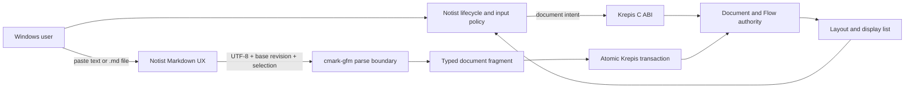

# 正式 Flow 文件與 Markdown 匯入執行計畫

狀態：Approved（2026-08-23；使用者核准 A/A/A 並要求開始實作）

## 目標與動機

先把 Krepis 已通過機器閘門的 Flow Editor 接成 Notist 可建立、開啟、保存與每天使用的第一份正式
Flow，再在 Block schema 穩定後加入「貼上 Markdown／匯入 `.md` → native Blocks → 自動渲染」。若把
兩者倒序，Markdown 只能落成 Flutter preview 或暫存 AST，會形成第二份內容 truth；若一次做完，任何
失敗都無法分辨是 lifecycle、editor、Block schema、parser 還是 renderer。

## 範圍

### In

- 以 NTS-0006 關閉第一個 runtime 的 `page-kind-decision`：production 只建立 `flow`。
- 建立最小 project／document lifecycle、Krepis-owned title、真實 Explorer projection 與單一 Flow Stage。
- 接上既有文字／IME／selection／undo／scroll／display list 與可丟棄 persistence。
- 完成 P1 七項 Windows 實機驗收。
- 在 Krepis 完成 Block kind／attrs／inline marks、revision-aware command、persistence 與 C ABI gate。
- 以 pinned `cmark-gfm` 解析 Markdown，原子轉成 native fragment；Notist 提供貼上／匯入／diagnostic UX。

### Out

- 不把 Canva／Sheet prototype 接入 production。
- 不做 Markdown source-mode、無損 round-trip、export、HTML／MDX／Mermaid execution。
- 不做 table、Todo、image asset 的 native Markdown mapping；第一版保留純文字與 diagnostic。
- 不做 tabs、split、collaboration、permission、AI／MCP、Ink 或正式 P4 authority。
- 不修改 Kallopis primitive／token API，不更新 golden，除非另取得明確核准。

## 方案

Notist 擁有專案選取、文件 route、剪貼簿／檔案 intent 與狀態呈現；所有內容、metadata、Block、marks、
transaction、history、layout 與 persistence 由 Krepis 擁有。Markdown parser 只產生尚未發布的 typed
fragment；authority 在 base revision 仍有效且完整 validation 通過後，一次發布。

凍結區：Kallopis 全倉、Notist Catalog／Canva／Sheet prototype、Quick Search／Journal／AI／Assets、Krepis
Ink／authority／permission，以及三倉既有不相關 dirty worktree。

## 分步實作清單

1. **基線與 provider contract。** 擷取三倉 HEAD、status 與所有目標／凍結檔 SHA-256；在 Krepis 先寫
   document metadata、lifecycle、save result 與 C ABI 的 failing contract tests。預計修改 Krepis
   `include/krepis/`、`src/`、`tests/`、`tests/CMakeLists.txt`。完成證據：新測試因尚無 API 而失敗，
   既有 34 tests 仍可獨立通過。
2. **Krepis 文件 lifecycle。** 實作 stable document root、title rename、create/list/open/save 與錯誤模型；
   延伸 dogfood codec version 並保留舊 fixture 的明確 migration／reject 行為。完成證據：provider unit、
   C ABI、截斷／未知版本／stale revision tests 全綠。
3. **Notist 正式 Flow Stage。** 建立 project/document controller 與 projection，將 production Project Stage
   從 empty state 接到既有 `NotistFlowEditor`，並讓 Explorer/header/save status 只投影 Krepis 結果。
   預計修改 `lib/src/project/`、`lib/src/sidebar/`、`lib/src/stage/`、`lib/src/krepis/` 與對應 tests。
   完成證據：空專案、新建、切換、rename、保存失敗／retry widget tests；production 無 prototype。
4. **Flow checkpoint。** 跑 Krepis Debug、Notist Verify、Windows native build，逐項執行 P1 七項人工驗收。
   完成證據：測試尾行、exit code 與七項人工記錄；未全過不得開始 Markdown runtime。
5. **Block provider gate。** 在 Krepis 另立／完成 Block kind、attrs、inline marks、multi-Block fragment、
   revision-aware atomic command、undo、display list、codec 與 C ABI。完成證據：`block-core-abi` 與
   `block-persistence-contract` 的 provider／consumer fixtures 全綠；Paragraph-only 路徑無回歸。
6. **Markdown parser spike。** 解析 `cmark-gfm 0.29.0.gfm.13` release，記錄完整 commit SHA、license、
   Windows／Clang build、AST node mapping、8 MiB fixture 的時間與峰值記憶體；只在 spike 通過後加入
   FetchContent。完成證據：官方 CommonMark/GFM subset fixtures、ASan、TSan 與 dependency license
   read-back；失敗則淘汰選型但不影響 Flow。
7. **Krepis Markdown import。** 新增 RAII parser wrapper、typed fragment、fallback diagnostic 與 atomic
   apply；整次操作一筆 undo。預計新增 `include/krepis/markdown_import.hpp`、`src/markdown_import.cpp`、
   tests 與 C ABI。完成證據：支援矩陣、fallback losslessness、stale／OOM／超限原子性 tests。
8. **Notist Markdown UX。** 接收 clipboard text 與 `.md` file intent，提供「貼上並格式化／貼上純文字」、
   import progress、typed failure 與 diagnostic；不加入 Dart Markdown parser。完成證據：widget tests、
   Windows clipboard／file smoke、匯入後 save／reopen。
9. **最終閘門與差異審查。** 跑兩倉完整 gates、provider／consumer ABI fixtures、ASan／TSan、Windows
   smoke，並比較凍結區 hash。完成證據：所有 exit code 0、無計畫外檔案 delta、Markdown 來源 hash
   不變；否則只回退失敗階段。

## 驗收條件

1. 空專案建立兩份 Flow 後，Explorer 顯示兩個不同 stable root ID 的真實投影；點擊任一文件只替換
   單一 Stage，沒有 tabs、split 或 prototype。
2. rename 經 Krepis 一次 transaction 後，內容標題、Explorer 與 Stage header 在同一 accepted revision
   顯示相同文字；stale rename 被拒絕且三處保持舊值。
3. 真實 FFI 依序完成 IME、Enter split、跨 Block merge、undo／redo、保存與重開，UTF-8、Block 順序、
   stable root ID 與 title 一致。
4. 保存失敗時只顯示 `failed`，磁碟保留最後成功檔；retry 成功後才顯示 `saved`。
5. P1 七項 Windows 人工驗收全部有通過記錄；任一未通過，Flow checkpoint 維持未完成。
6. Markdown 支援矩陣每種 syntax 都產生預期 Block／mark；fallback syntax 的原始 UTF-8 逐 byte 可重建。
7. 一次貼上 100 Blocks 只增加一筆 undo；undo／redo 前後 revision、selection 與語意內容符合 fixture。
8. 超限、畸形 UTF-8、stale revision、parser failure 都不改 document revision、undo depth 或保存檔。
9. 同一 clipboard payload 可選格式化或純文字；Notist dependency tree 不含 Markdown parser／HTML renderer。
10. 匯入 `.md` 後保存重開語意一致，來源檔 SHA-256 不變；raw HTML 不執行也不建立 WebView。
11. Krepis Debug／ASan／TSan、Notist Verify 與 Windows native smoke 全部 exit code 0。

## 風險與回退

| 風險 | 偵測訊號 | 應對 |
| --- | --- | --- |
| Dirty worktree 混入使用者既有內容 | 目標外檔案 hash 改變、patch 出現未列路徑 | 每階段前後記錄 status／SHA-256；只套小 patch；無法辨識 ownership 時停止 |
| Markdown schema 在 Block contract 前固化 | parser mapping 出現 Flutter-only node 或臨時 attrs | Markdown runtime 必須等待兩個 Block gate；spike 只輸出報告，不發布 API |
| 大型／惡意 Markdown 阻塞或丟資料 | UI frame stall、部分 Blocks、fallback 無法重建 source | 大小硬限、背景 parse、base revision validation、單筆 publish、losslessness／ASan fixtures |

整體回退：Flow 與 Markdown 使用加法式獨立階段；Markdown 任一 gate 失敗只移除 import command／UI 入口，
保留已驗證的正式 Flow。Flow 接線失敗則回到 production empty state，不刪 Krepis dogfood 檔或 prototype。

## 已裁決問題

- Q1 A：專案使用 app-managed local project。
- Q2 A：匯入 `.md` 建立新的 Flow，檔名 stem 作初始 title。
- Q3 A：單次 Markdown 上限為 8 MiB，超過即 fail closed。
